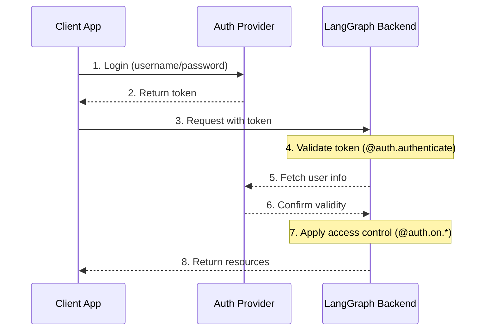
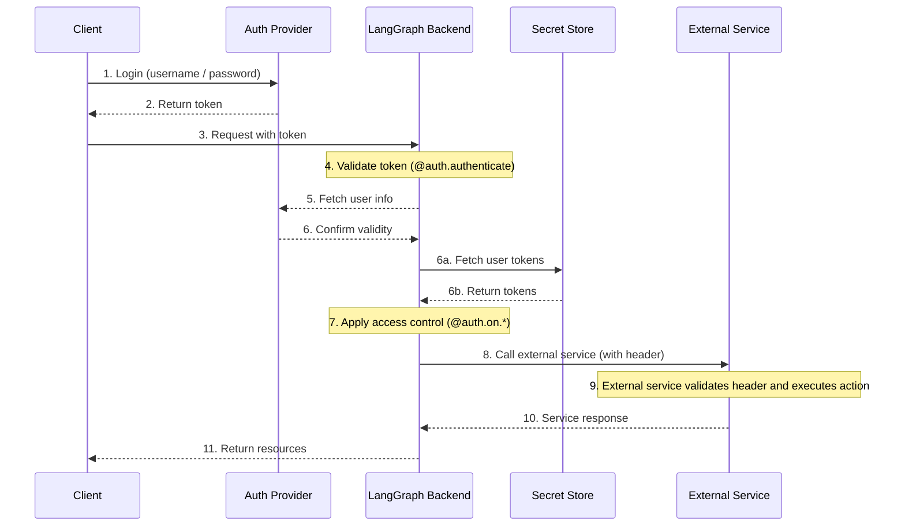

LangSmith는 대부분의 인증 방식과 통합할 수 있는 유연한 인증 및 권한 부여 시스템을 제공합니다.

## 핵심 개념

### 인증(Authentication) vs 권한 부여(Authorization)

이 용어들은 종종 혼용되지만, 실제로는 서로 다른 보안 개념을 의미합니다:

* [**Authentication**](#authentication) ("AuthN")은 _누구인지_를 검증합니다. 모든 요청에 대해 미들웨어로 실행됩니다.
* [**Authorization**](#authorization) ("AuthZ")는 _무엇을 할 수 있는지_를 결정합니다. 사용자 권한과 역할을 리소스별로 검증합니다.

LangSmith에서는 인증이 [`@auth.authenticate`](/langsmith/smith-python-sdk#langgraph_sdk.auth.Auth.authenticate) 핸들러에 의해 처리되고, 권한 부여는 [`@auth.on`](/langsmith/langgraph-python-sdk#langgraph_sdk.auth.Auth.on) 핸들러에 의해 처리됩니다.

## 기본 보안 모델

LangSmith는 다양한 보안 기본값을 제공합니다:

### LangSmith

* 기본적으로 LangSmith API 키를 사용합니다
* `x-api-key` 헤더에 유효한 API 키가 필요합니다
* 인증 핸들러를 통해 커스터마이즈할 수 있습니다

<Note>
**커스텀 인증**
LangSmith의 모든 요금제에서 커스텀 인증을 **지원합니다**.
</Note>

### 셀프 호스팅(Self-Hosted)

* 기본 인증 없음
* 보안 모델을 완전히 자유롭게 구현 가능
* 인증 및 권한 부여의 모든 측면을 직접 제어할 수 있습니다

## 시스템 아키텍처

일반적인 인증 설정은 세 가지 주요 구성 요소로 이루어집니다:

1. **Authentication Provider** (Identity Provider/IdP)
  * 사용자 신원 및 자격 증명을 관리하는 전용 서비스
  * 사용자 등록, 로그인, 비밀번호 재설정 등을 처리
  * 인증 성공 시 토큰(JWT, 세션 토큰 등)을 발급
  * 예시: Auth0, Supabase Auth, Okta, 또는 자체 인증 서버
2. **LangGraph Backend** (Resource Server)
  * 비즈니스 로직과 보호된 리소스를 포함하는 LangGraph 애플리케이션
  * 인증 제공자와 토큰을 검증
  * 사용자 신원 및 권한에 따라 접근 제어를 적용
  * 사용자 자격 증명을 직접 저장하지 않음
3. **Client Application** (Frontend)
  * 웹 앱, 모바일 앱, 또는 API 클라이언트
  * 시간에 민감한 사용자 자격 증명을 수집하여 인증 제공자에 전달
  * 인증 제공자로부터 토큰을 수신
  * LangGraph 백엔드 요청에 토큰을 포함

이 구성 요소들이 상호작용하는 방식은 다음과 같습니다:



LangGraph의 [`@auth.authenticate`](/langsmith/langgraph-python-sdk#langgraph_sdk.auth.Auth.authenticate) 핸들러는 4~6단계를 처리하며, [`@auth.on`](/langsmith/langgraph-python-sdk#langgraph_sdk.auth.Auth.on) 핸들러는 7단계를 구현합니다.

## 인증(Authentication)

LangGraph에서 인증은 모든 요청에 대해 미들웨어로 실행됩니다. [`@auth.authenticate`](/langsmith/langgraph-python-sdk#langgraph_sdk.auth.Auth.authenticate) 핸들러는 요청 정보를 받아 다음을 수행해야 합니다:

1. 자격 증명 검증
2. 유효한 경우 사용자의 신원 및 정보를 포함하는 [user info](https://langchain-ai.github.io/langgraph/cloud/reference/sdk/python_sdk_ref/#langgraph_sdk.auth.types.MinimalUserDict) 반환
3. 유효하지 않은 경우 [HTTP exception](https://langchain-ai.github.io/langgraph/cloud/reference/sdk/python_sdk_ref/#langgraph_sdk.auth.exceptions.HTTPException) 또는 AssertionError 발생

```python
from langgraph_sdk import Auth

auth = Auth()

@auth.authenticate
async def authenticate(headers: dict) -> Auth.types.MinimalUserDict:
    # Validate credentials (e.g., API key, JWT token)
    api_key = headers.get(b"x-api-key")
    if not api_key or not is_valid_key(api_key):
        raise Auth.exceptions.HTTPException(
            status_code=401,
            detail="Invalid API key"
        )

    # Return user info - only identity and is_authenticated are required
    # Add any additional fields you need for authorization
    return {
        "identity": "user-123",        # Required: unique user identifier
        "is_authenticated": True,      # Optional: assumed True by default
        "permissions": ["read", "write"] # Optional: for permission-based auth
        # You can add more custom fields if you want to implement other auth patterns
        "role": "admin",
        "org_id": "org-456"

    }
```

반환된 사용자 정보는 다음 위치에서 사용할 수 있습니다:

* 권한 부여 핸들러에서 [`ctx.user`](https://langchain-ai.github.io/langgraph/cloud/reference/sdk/python_sdk_ref/#langgraph_sdk.auth.types.AuthContext)를 통해
* 애플리케이션에서 `config["configuration"]["langgraph_auth_user"]`를 통해

<Accordion title="지원되는 파라미터">
  [`@auth.authenticate`](https://langchain-ai.github.io/langgraph/cloud/reference/sdk/python_sdk_ref/#langgraph_sdk.auth.Auth.authenticate) 핸들러는 다음 파라미터 중 이름으로 전달된 값을 받을 수 있습니다:

  * request (Request): 원시 ASGI 요청 객체
  * path (str): 요청 경로, 예시: `"/threads/abcd-1234-abcd-1234/runs/abcd-1234-abcd-1234/stream"`
  * method (str): HTTP 메서드, 예시: `"GET"`
  * path_params (dict[str, str]): URL 경로 파라미터, 예시: `{"thread_id": "abcd-1234-abcd-1234", "run_id": "abcd-1234-abcd-1234"}`
  * query_params (dict[str, str]): URL 쿼리 파라미터, 예시: `{"stream": "true"}`
  * headers (dict[bytes, bytes]): 요청 헤더
  * authorization (str | None): Authorization 헤더 값 (예시: `"Bearer <token>"`)

  많은 튜토리얼에서는 간결함을 위해 "authorization" 파라미터만 보여주지만, 필요에 따라 더 많은 정보를 받아 커스텀 인증 방식을 구현할 수 있습니다.
</Accordion>

### 에이전트 인증

커스텀 인증을 통해 위임된 접근이 가능합니다. `@auth.authenticate`에서 반환한 값은 실행 컨텍스트에 추가되며, 에이전트에게 사용자 범위의 자격 증명을 제공하면 사용자를 대신하여 리소스에 접근할 수 있습니다.



인증 후, 플랫폼은 그래프와 모든 노드에 전달되는 특별한 구성 객체를 생성합니다.
이 객체에는 현재 사용자에 대한 정보와 [`@auth.authenticate`](https://langchain-ai.github.io/langgraph/cloud/reference/sdk/python_sdk_ref/#langgraph_sdk.auth.Auth.authenticate) 핸들러에서 반환한 커스텀 필드가 포함됩니다.

에이전트가 사용자를 대신하여 동작하도록 하려면 [커스텀 인증 미들웨어](/langsmith/custom-auth)를 사용하세요. 이를 통해 에이전트가 MCP 서버, 외부 데이터베이스, 다른 에이전트 등 외부 시스템과 사용자를 대신하여 상호작용할 수 있습니다.

자세한 내용은 [커스텀 인증 사용](/langsmith/custom-auth#enable-agent-authentication) 가이드를 참고하세요.

### MCP를 통한 에이전트 인증

에이전트를 MCP 서버에 인증하는 방법에 대한 정보는 [MCP 개념 가이드](/oss/python/langchain/mcp)를 참고하세요.

## 권한 부여(Authorization)

인증 후, LangGraph는 [`@auth.on`](https://langchain-ai.github.io/langgraph/cloud/reference/sdk/python_sdk_ref/#langgraph_sdk.auth.Auth.on) 핸들러를 호출하여 특정 리소스(예: threads, assistants, crons)에 대한 접근을 제어합니다. 이 핸들러는 다음을 수행할 수 있습니다:

1. 리소스 생성 시 `value["metadata"]` 딕셔너리를 직접 수정하여 저장될 메타데이터 추가. 각 액션별로 value가 가질 수 있는 타입은 [지원되는 액션 표](#supported-actions)를 참고하세요.
2. 검색/목록 또는 읽기 작업 시 메타데이터로 리소스를 필터링하여 [필터 딕셔너리](#filter-operations)를 반환
3. 접근이 거부된 경우 HTTP exception 발생

단순한 사용자 범위의 접근 제어만 구현하려면 모든 리소스와 액션에 대해 하나의 [`@auth.on`](https://langchain-ai.github.io/langgraph/cloud/reference/sdk/python_sdk_ref/#langgraph_sdk.auth.Auth.on) 핸들러를 사용할 수 있습니다. 리소스와 액션에 따라 다른 제어가 필요하다면 [리소스별 핸들러](#resource-specific-handlers)를 사용할 수 있습니다. 접근 제어를 지원하는 전체 리소스 목록은 [지원되는 리소스](#supported-resources) 섹션을 참고하세요.

```python
@auth.on
async def add_owner(
    ctx: Auth.types.AuthContext,
    value: dict  # The payload being sent to this access method
) -> dict:  # Returns a filter dict that restricts access to resources
    """Authorize all access to threads, runs, crons, and assistants.

    This handler does two things:
        - Adds a value to resource metadata (to persist with the resource so it can be filtered later)
        - Returns a filter (to restrict access to existing resources)

    Args:
        ctx: Authentication context containing user info, permissions, the path, and
        value: The request payload sent to the endpoint. For creation
              operations, this contains the resource parameters. For read
              operations, this contains the resource being accessed.

    Returns:
        A filter dictionary that LangGraph uses to restrict access to resources.
        See [Filter Operations](#filter-operations) for supported operators.
    """
    # Create filter to restrict access to just this user's resources
    filters = {"owner": ctx.user.identity}

    # Get or create the metadata dictionary in the payload
    # This is where we store persistent info about the resource
    metadata = value.setdefault("metadata", {})

    # Add owner to metadata - if this is a create or update operation,
    # this information will be saved with the resource
    # So we can filter by it later in read operations
    metadata.update(filters)

    # Return filters to restrict access
    # These filters are applied to ALL operations (create, read, update, search, etc.)
    # to ensure users can only access their own resources
    return filters
```

<a id="resource-specific-handlers"></a>
### 리소스별 핸들러(Resource-Specific Handlers)

[`@auth.on`](https://langchain-ai.github.io/langgraph/cloud/reference/sdk/python_sdk_ref/#langgraph_sdk.auth.Auth.on) 데코레이터에 리소스와 액션 이름을 연결하여 특정 리소스와 액션에 대한 핸들러를 등록할 수 있습니다.
요청이 들어오면 해당 리소스와 액션에 가장 구체적으로 일치하는 핸들러가 호출됩니다. 아래는 특정 리소스와 액션에 대한 핸들러를 등록하는 예시입니다. 다음과 같은 설정을 가정합니다:

1. 인증된 사용자는 thread 생성, thread 읽기, thread에서 run 생성이 가능합니다
2. "assistants:create" 권한이 있는 사용자만 새로운 assistant 생성이 가능합니다
3. 그 외 모든 엔드포인트(예: assistant 삭제, crons, store)는 모든 사용자에게 비활성화됩니다

<Tip>
**지원되는 핸들러**
지원되는 리소스와 액션의 전체 목록은 아래 [지원되는 리소스](#supported-resources) 섹션을 참고하세요.
</Tip>

```python
# Generic / global handler catches calls that aren't handled by more specific handlers
@auth.on
async def reject_unhandled_requests(ctx: Auth.types.AuthContext, value: Any) -> False:
    print(f"Request to {ctx.path} by {ctx.user.identity}")
    raise Auth.exceptions.HTTPException(
        status_code=403,
        detail="Forbidden"
    )

# Matches the "thread" resource and all actions - create, read, update, delete, search
# Since this is **more specific** than the generic @auth.on handler, it will take precedence
# over the generic handler for all actions on the "threads" resource
@auth.on.threads
async def on_thread(
    ctx: Auth.types.AuthContext,
    value: Auth.types.threads.create.value
):
    # Setting metadata on the thread being created
    # will ensure that the resource contains an "owner" field
    # Then any time a user tries to access this thread or runs within the thread,
    # we can filter by owner
    metadata = value.setdefault("metadata", {})
    metadata["owner"] = ctx.user.identity
    return {"owner": ctx.user.identity}


# Thread creation. This will match only on thread create actions
# Since this is **more specific** than both the generic @auth.on handler and the @auth.on.threads handler,
# it will take precedence for any "create" actions on the "threads" resources
@auth.on.threads.create
async def on_thread_create(
    ctx: Auth.types.AuthContext,
    value: Auth.types.threads.create.value
):
    # Reject if the user does not have write access
    if "write" not in ctx.permissions:
        raise Auth.exceptions.HTTPException(
            status_code=403,
            detail="User lacks the required permissions."
        )
    # Setting metadata on the thread being created
    # will ensure that the resource contains an "owner" field
    # Then any time a user tries to access this thread or runs within the thread,
    # we can filter by owner
    metadata = value.setdefault("metadata", {})
    metadata["owner"] = ctx.user.identity
    return {"owner": ctx.user.identity}

# Reading a thread. Since this is also more specific than the generic @auth.on handler, and the @auth.on.threads handler,
# it will take precedence for any "read" actions on the "threads" resource
@auth.on.threads.read
async def on_thread_read(
    ctx: Auth.types.AuthContext,
    value: Auth.types.threads.read.value
):
    # Since we are reading (and not creating) a thread,
    # we don't need to set metadata. We just need to
    # return a filter to ensure users can only see their own threads
    return {"owner": ctx.user.identity}

# Run creation, streaming, updates, etc.
# This takes precedenceover the generic @auth.on handler and the @auth.on.threads handler
@auth.on.threads.create_run
async def on_run_create(
    ctx: Auth.types.AuthContext,
    value: Auth.types.threads.create_run.value
):
    metadata = value.setdefault("metadata", {})
    metadata["owner"] = ctx.user.identity
    # Inherit thread's access control
    return {"owner": ctx.user.identity}

# Assistant creation
@auth.on.assistants.create
async def on_assistant_create(
    ctx: Auth.types.AuthContext,
    value: Auth.types.assistants.create.value
):
    if "assistants:create" not in ctx.permissions:
        raise Auth.exceptions.HTTPException(
            status_code=403,
            detail="User lacks the required permissions."
        )
```

위 예시에서는 글로벌 핸들러와 리소스별 핸들러를 혼합하여 사용하고 있습니다. 각 요청은 가장 구체적인 핸들러에 의해 처리되므로, thread 생성 요청은 `on_thread_create` 핸들러에 매칭되고 `reject_unhandled_requests` 핸들러에는 매칭되지 않습니다. 반면 thread 업데이트 요청은 해당 리소스와 액션에 더 구체적인 핸들러가 없으므로 글로벌 핸들러에서 처리됩니다.

<a id="filter-operations"></a>
### 필터 연산(Filter Operations)

권한 부여 핸들러는 `None`, boolean, 또는 필터 딕셔너리를 반환할 수 있습니다.

* `None` 및 `True`는 "모든 하위 리소스에 접근 허용"을 의미합니다
* `False`는 "모든 하위 리소스에 접근 거부(403 예외 발생)"를 의미합니다
* 메타데이터 필터 딕셔너리는 리소스 접근을 제한합니다

필터 딕셔너리는 리소스 메타데이터와 일치하는 키를 가진 딕셔너리입니다. 세 가지 연산자를 지원합니다:

* 기본값은 아래 "$eq"와 동일한 정확한 일치(Exact match)입니다. 예: `{"owner": user_id}`는 메타데이터에 `{"owner": user_id}`가 포함된 리소스만 포함합니다
* `$eq`: 정확한 일치 (예: `{"owner": {"$eq": user_id}}`) - 위의 축약형과 동일, 즉 `{"owner": user_id}`
* `$contains`: 리스트 멤버십(예: `{"allowed_users": {"$contains": user_id}}`) 또는 리스트 포함(예: `{"allowed_users": {"$contains": [user_id_1, user_id_2]}}`). 값은 리스트의 요소 또는 리스트의 부분집합이어야 하며, 저장된 리소스의 메타데이터는 리스트/컨테이너 타입이어야 합니다.

여러 키가 있는 딕셔너리는 논리적 `AND` 필터로 처리됩니다. 예: `{"owner": org_id, "allowed_users": {"$contains": user_id}}`는 "owner"가 `org_id`이고 "allowed_users" 리스트에 `user_id`가 포함된 메타데이터를 가진 리소스만 매칭합니다.
자세한 내용은 [참고 문서](https://langchain-ai.github.io/langgraph/cloud/reference/sdk/python_sdk_ref/#langgraph_sdk.auth.types.FilterType)를 참고하세요.

## 일반적인 접근 패턴

다음은 일반적인 권한 부여 패턴입니다:

### 단일 소유자 리소스(Single-Owner Resources)

이 패턴은 모든 thread, assistant, cron, run을 단일 사용자 범위로 제한합니다. 일반적인 챗봇 스타일 앱 등 단일 사용자 사용 사례에 유용합니다.

```python
@auth.on
async def owner_only(ctx: Auth.types.AuthContext, value: dict):
    metadata = value.setdefault("metadata", {})
    metadata["owner"] = ctx.user.identity
    return {"owner": ctx.user.identity}
```

### 권한 기반 접근(Permission-based Access)

이 패턴은 **권한**에 따라 접근을 제어할 수 있습니다. 특정 역할에 따라 리소스 접근 범위를 넓히거나 제한하고 싶을 때 유용합니다.

```python
# In your auth handler:
@auth.authenticate
async def authenticate(headers: dict) -> Auth.types.MinimalUserDict:
    ...
    return {
        "identity": "user-123",
        "is_authenticated": True,
        "permissions": ["threads:write", "threads:read"]  # Define permissions in auth
    }

def _default(ctx: Auth.types.AuthContext, value: dict):
    metadata = value.setdefault("metadata", {})
    metadata["owner"] = ctx.user.identity
    return {"owner": ctx.user.identity}

@auth.on.threads.create
async def create_thread(ctx: Auth.types.AuthContext, value: dict):
    if "threads:write" not in ctx.permissions:
        raise Auth.exceptions.HTTPException(
            status_code=403,
            detail="Unauthorized"
        )
    return _default(ctx, value)


@auth.on.threads.read
async def rbac_create(ctx: Auth.types.AuthContext, value: dict):
    if "threads:read" not in ctx.permissions and "threads:write" not in ctx.permissions:
        raise Auth.exceptions.HTTPException(
            status_code=403,
            detail="Unauthorized"
        )
    return _default(ctx, value)
```

## 지원되는 리소스

LangGraph는 가장 일반적인 것부터 가장 구체적인 것까지 세 가지 수준의 권한 부여 핸들러를 제공합니다:

1. **글로벌 핸들러** (`@auth.on`): 모든 리소스와 액션에 매칭
2. **리소스 핸들러** (예: `@auth.on.threads`, `@auth.on.assistants`, `@auth.on.crons`): 특정 리소스의 모든 액션에 매칭
3. **액션 핸들러** (예: `@auth.on.threads.create`, `@auth.on.threads.read`): 특정 리소스의 특정 액션에 매칭

가장 구체적으로 매칭되는 핸들러가 사용됩니다. 예를 들어, thread 생성에는 `@auth.on.threads.create`가 `@auth.on.threads`보다 우선합니다.
더 구체적인 핸들러가 등록되어 있으면, 더 일반적인 핸들러는 해당 리소스와 액션에 대해 호출되지 않습니다.

<Tip>
"타입 안전성(Type Safety)"
각 핸들러는 `value` 파라미터에 대해 `Auth.types.on.<resource>.<action>.value`에서 타입 힌트를 제공합니다. 예시:

```python
@auth.on.threads.create
async def on_thread_create(
ctx: Auth.types.AuthContext,
value: Auth.types.on.threads.create.value  # Specific type for thread creation
):
...

@auth.on.threads
async def on_threads(
ctx: Auth.types.AuthContext,
value: Auth.types.on.threads.value  # Union type of all thread actions
):
...

@auth.on
async def on_all(
ctx: Auth.types.AuthContext,
value: dict  # Union type of all possible actions
):
...
```

더 구체적인 핸들러일수록 처리하는 액션 타입이 적으므로 더 나은 타입 힌트를 제공합니다.
</Tip>

<a id="supported-actions"></a>
#### 지원되는 액션 및 타입

지원되는 모든 액션 핸들러는 다음과 같습니다:

| 리소스 | 핸들러 | 설명 | Value 타입 |
|----------|---------|-------------|------------|
| **Threads** | `@auth.on.threads.create` | Thread 생성 | [`ThreadsCreate`](https://langchain-ai.github.io/langgraph/cloud/reference/sdk/python_sdk_ref/#langgraph_sdk.auth.types.ThreadsCreate) |
| | `@auth.on.threads.read` | Thread 조회 | [`ThreadsRead`](https://langchain-ai.github.io/langgraph/cloud/reference/sdk/python_sdk_ref/#langgraph_sdk.auth.types.ThreadsRead) |
| | `@auth.on.threads.update` | Thread 업데이트 | [`ThreadsUpdate`](https://langchain-ai.github.io/langgraph/cloud/reference/sdk/python_sdk_ref/#langgraph_sdk.auth.types.ThreadsUpdate) |
| | `@auth.on.threads.delete` | Thread 삭제 | [`ThreadsDelete`](https://langchain-ai.github.io/langgraph/cloud/reference/sdk/python_sdk_ref/#langgraph_sdk.auth.types.ThreadsDelete) |
| | `@auth.on.threads.search` | Thread 목록 조회 | [`ThreadsSearch`](https://langchain-ai.github.io/langgraph/cloud/reference/sdk/python_sdk_ref/#langgraph_sdk.auth.types.ThreadsSearch) |
| | `@auth.on.threads.create_run` | Run 생성 또는 업데이트 | [`RunsCreate`](https://langchain-ai.github.io/langgraph/cloud/reference/sdk/python_sdk_ref/#langgraph_sdk.auth.types.RunsCreate) |
| **Assistants** | `@auth.on.assistants.create` | Assistant 생성 | [`AssistantsCreate`](https://langchain-ai.github.io/langgraph/cloud/reference/sdk/python_sdk_ref/#langgraph_sdk.auth.types.AssistantsCreate) |
| | `@auth.on.assistants.read` | Assistant 조회 | [`AssistantsRead`](https://langchain-ai.github.io/langgraph/cloud/reference/sdk/python_sdk_ref/#langgraph_sdk.auth.types.AssistantsRead) |
| | `@auth.on.assistants.update` | Assistant 업데이트 | [`AssistantsUpdate`](https://langchain-ai.github.io/langgraph/cloud/reference/sdk/python_sdk_ref/#langgraph_sdk.auth.types.AssistantsUpdate) |
| | `@auth.on.assistants.delete` | Assistant 삭제 | [`AssistantsDelete`](https://langchain-ai.github.io/langgraph/cloud/reference/sdk/python_sdk_ref/#langgraph_sdk.auth.types.AssistantsDelete) |
| | `@auth.on.assistants.search` | Assistant 목록 조회 | [`AssistantsSearch`](https://langchain-ai.github.io/langgraph/cloud/reference/sdk/python_sdk_ref/#langgraph_sdk.auth.types.AssistantsSearch) |
| **Crons** | `@auth.on.crons.create` | Cron job 생성 | [`CronsCreate`](https://langchain-ai.github.io/langgraph/cloud/reference/sdk/python_sdk_ref/#langgraph_sdk.auth.types.CronsCreate) |
| | `@auth.on.crons.read` | Cron job 조회 | [`CronsRead`](https://langchain-ai.github.io/langgraph/cloud/reference/sdk/python_sdk_ref/#langgraph_sdk.auth.types.CronsRead) |
| | `@auth.on.crons.update` | Cron job 업데이트 | [`CronsUpdate`](https://langchain-ai.github.io/langgraph/cloud/reference/sdk/python_sdk_ref/#langgraph_sdk.auth.types.CronsUpdate) |
| | `@auth.on.crons.delete` | Cron job 삭제 | [`CronsDelete`](https://langchain-ai.github.io/langgraph/cloud/reference/sdk/python_sdk_ref/#langgraph_sdk.auth.types.CronsDelete) |
| | `@auth.on.crons.search` | Cron job 목록 조회 | [`CronsSearch`](https://langchain-ai.github.io/langgraph/cloud/reference/sdk/python_sdk_ref/#langgraph_sdk.auth.types.CronsSearch) |

<Note>
"Run에 대하여"

Run은 접근 제어를 위해 부모 thread에 범위가 지정됩니다. 즉, 권한은 일반적으로 thread에서 상속되며, 이는 데이터 모델의 대화형 특성을 반영합니다. 모든 run 작업(읽기, 목록 조회)은 생성 작업을 제외하고 thread의 핸들러에 의해 제어됩니다.
새로운 run을 생성할 때는 더 많은 인자를 받을 수 있으므로 별도의 `create_run` 핸들러가 있습니다.
</Note>

## 다음 단계

구현 세부 사항은 다음을 참고하세요:

* [인증 설정 튜토리얼](/langsmith/set-up-custom-auth)에서 소개를 확인하세요
* [커스텀 인증 핸들러 구현](/langsmith/custom-auth) 방법 가이드를 참고하세요

---

<Callout icon="pen-to-square" iconType="regular">
    [Edit the source of this page on GitHub.](https://github.com/langchain-ai/docs/edit/main/src/langsmith/auth.mdx)
</Callout>
<Tip icon="terminal" iconType="regular">
    [Connect these docs programmatically](/use-these-docs) to Claude, VSCode, and more via MCP for    real-time answers.
</Tip>
