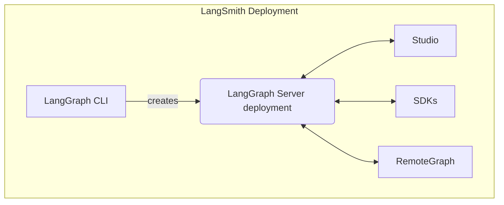

[LangSmith 전체 플랫폼 배포](/langsmith/deploy-self-hosted-full-platform)를 사용하여 셀프 호스팅을 실행할 때, 설치에는 여러 핵심 구성 요소가 포함됩니다. 이러한 도구와 서비스는 자체 인프라에서 graph(에이전트 애플리케이션 포함)를 구축, 배포 및 관리하기 위한 완전한 솔루션을 제공합니다:



- [LangGraph Server](/langsmith/langgraph-server): graph와 agent를 배포하기 위한 독자적인 API와 runtime을 정의합니다. 실행, state 관리 및 persistence를 처리하여 서버 인프라가 아닌 로직 구축에 집중할 수 있도록 합니다.
- [LangGraph CLI](/langsmith/cli): 로컬에서 graph를 빌드, 패키징 및 상호작용하고 배포를 준비하기 위한 command-line interface입니다.
- [Studio](/langsmith/studio): 시각화, 상호작용 및 디버깅을 위한 특화된 IDE입니다. graph를 개발하고 테스트하기 위해 로컬 LangGraph Server에 연결됩니다.
- [Python/JS SDK](/langsmith/sdk): Python/JS SDK는 애플리케이션에서 배포된 graph와 agent와 프로그래밍 방식으로 상호작용할 수 있는 방법을 제공합니다.
- [RemoteGraph](/langsmith/use-remote-graph): 배포된 graph를 로컬에서 실행되는 것처럼 상호작용할 수 있게 해줍니다.
- [Control Plane](/langsmith/control-plane): LangGraph Server 배포를 생성, 업데이트 및 관리하기 위한 UI와 API입니다.
- [Data plane](/langsmith/data-plane): graph를 실행하는 runtime 레이어로, LangGraph Server, 백업 서비스(PostgreSQL, Redis 등) 및 control plane의 state를 조정하는 listener를 포함합니다.
```

---

<Callout icon="pen-to-square" iconType="regular">
    [Edit the source of this page on GitHub.](https://github.com/langchain-ai/docs/edit/main/src/langsmith/components.mdx)
</Callout>
<Tip icon="terminal" iconType="regular">
    [Connect these docs programmatically](/use-these-docs) to Claude, VSCode, and more via MCP for    real-time answers.
</Tip>
