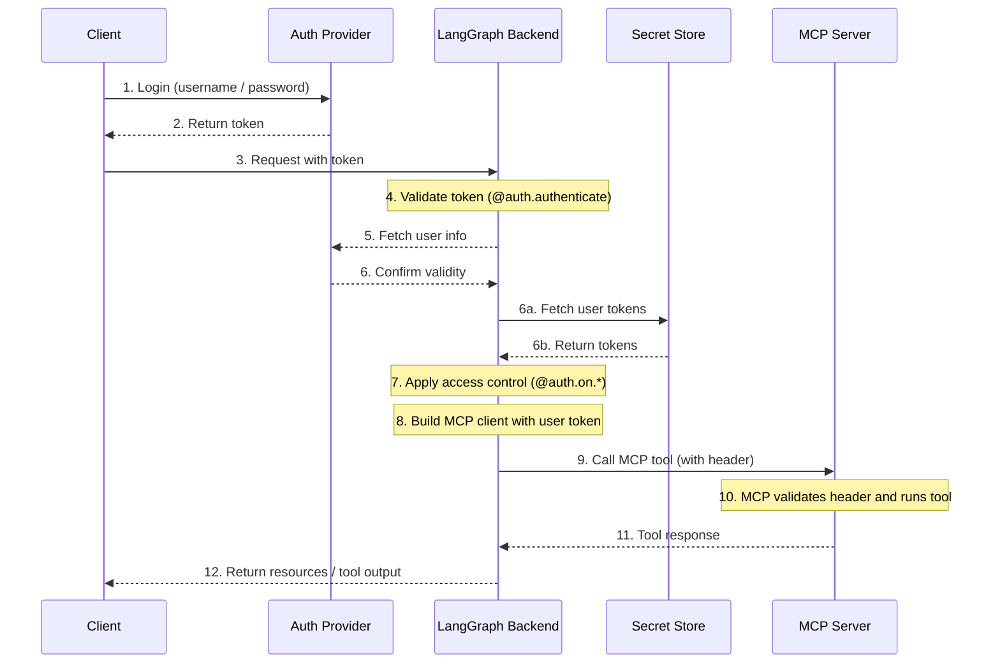

Model Context Protocol (MCP)은 모델에 구애받지 않는 형식으로 도구와 데이터 소스를 설명하기 위한 개방형 프로토콜로, LLM이 구조화된 API를 통해 이를 발견하고 사용할 수 있도록 합니다.

[LangGraph Server](/langsmith/langgraph-server)는 [Streamable HTTP transport](https://spec.modelcontextprotocol.io/specification/2025-03-26/basic/transports/#streamable-http)를 사용하여 MCP를 구현합니다. 이를 통해 LangGraph **agent**를 **MCP tool**로 노출할 수 있으며, Streamable HTTP를 지원하는 모든 MCP 호환 클라이언트에서 사용할 수 있습니다.

MCP endpoint는 [LangGraph Server](/langsmith/langgraph-server)의 `/mcp`에서 사용할 수 있습니다.

[사용자 정의 인증 미들웨어](/langsmith/custom-auth)를 설정하여 MCP 서버로 사용자를 인증하고 LangSmith 배포 내에서 사용자 범위 도구에 대한 액세스를 얻을 수 있습니다.

이 흐름에 대한 예시 아키텍처:



## Requirements

MCP를 사용하려면 다음 종속성이 설치되어 있는지 확인하세요:

* `langgraph-api >= 0.2.3`
* `langgraph-sdk >= 0.1.61`

다음 명령으로 설치하세요:

<CodeGroup>
```bash pip
pip install "langgraph-api>=0.2.3" "langgraph-sdk>=0.1.61"
```

```bash uv
uv add "langgraph-api>=0.2.3" "langgraph-sdk>=0.1.61"
```
</CodeGroup>

## 사용 개요

MCP를 활성화하려면:

* langgraph-api>=0.2.3을 사용하도록 업그레이드하세요. LangSmith를 배포하는 경우 새 revision을 생성하면 자동으로 수행됩니다.
* MCP tool(agent)이 자동으로 노출됩니다.
* Streamable HTTP를 지원하는 MCP 호환 클라이언트와 연결하세요.

### Client

MCP 호환 클라이언트를 사용하여 LangGraph 서버에 연결하세요. 다음 예제는 다양한 프로그래밍 언어를 사용하여 연결하는 방법을 보여줍니다.

<Tabs>
    <Tab title="JavaScript/TypeScript">
    ```bash
    npm install @modelcontextprotocol/sdk
    ```

        > **참고**
        > `serverUrl`을 LangGraph 서버 URL로 교체하고 필요에 따라 인증 헤더를 구성하세요.

    ```js
    import { Client } from "@modelcontextprotocol/sdk/client/index.js";
    import { StreamableHTTPClientTransport } from "@modelcontextprotocol/sdk/client/streamableHttp.js";

    // Connects to the LangGraph MCP endpoint
    async function connectClient(url) {
        const baseUrl = new URL(url);
        const client = new Client({
            name: 'streamable-http-client',
            version: '1.0.0'
        });

        const transport = new StreamableHTTPClientTransport(baseUrl);
        await client.connect(transport);

        console.log("Connected using Streamable HTTP transport");
        console.log(JSON.stringify(await client.listTools(), null, 2));
        return client;
    }

    const serverUrl = "http://localhost:2024/mcp";

    connectClient(serverUrl)
        .then(() => {
            console.log("Client connected successfully");
        })
        .catch(error => {
            console.error("Failed to connect client:", error);
        });
    ```
    </Tab>
    <Tab title="Python">
    다음 명령으로 adapter를 설치하세요:

    ```bash
    pip install langchain-mcp-adapters
    ```

    다음은 원격 MCP endpoint에 연결하고 agent를 tool로 사용하는 예제입니다:

    ```python
    # Create server parameters for stdio connection
    from mcp import ClientSession
    from mcp.client.streamable_http import streamablehttp_client
    import asyncio

    from langchain_mcp_adapters.tools import load_mcp_tools
    from langchain.agents import create_agent


    server_params = {
        "url": "https://mcp-finance-agent.xxx.us.langgraph.app/mcp",
        "headers": {
            "X-Api-Key":"lsv2_pt_your_api_key"
        }
    }

    async def main():
        async with streamablehttp_client(**server_params) as (read, write, _):
            async with ClientSession(read, write) as session:
                # Initialize the connection
                await session.initialize()

                # Load the remote graph as if it was a tool
                tools = await load_mcp_tools(session)

                # Create and run a react agent with the tools
                agent = create_agent("openai:gpt-4.1", tools)

                # Invoke the agent with a message
                agent_response = await agent.ainvoke({"messages": "What can the finance agent do for me?"})
                print(agent_response)

    if __name__ == "__main__":
        asyncio.run(main())
    ```
    </Tab>
</Tabs>

## agent를 MCP tool로 노출하기

배포되면 agent가 다음 구성으로 MCP endpoint에 tool로 표시됩니다:

* **Tool name**: agent의 이름.
* **Tool description**: agent의 설명.
* **Tool input schema**: agent의 input schema.

### 이름과 설명 설정하기

`langgraph.json`에서 agent의 이름과 설명을 설정할 수 있습니다:

```json
{
    "graphs": {
        "my_agent": {
            "path": "./my_agent/agent.py:graph",
            "description": "A description of what the agent does"
        }
    },
    "env": ".env"
}
```

배포 후 LangGraph SDK를 사용하여 이름과 설명을 업데이트할 수 있습니다.

### Schema

불필요한 내부 복잡성을 LLM에 노출하지 않도록 명확하고 최소한의 input 및 output schema를 정의하세요.

기본 [MessagesState](/oss/python/langgraph/graph-api#messagesstate)는 `AnyMessage`를 사용하며, 이는 많은 메시지 유형을 지원하지만 LLM에 직접 노출하기에는 너무 일반적입니다.

대신 명시적으로 타입이 지정된 input 및 output 구조를 사용하는 **사용자 정의 agent 또는 workflow**를 정의하세요.

예를 들어, 문서 질문에 답변하는 workflow는 다음과 같을 수 있습니다:

```python
from langgraph.graph import StateGraph, START, END
from typing_extensions import TypedDict

# Define input schema
class InputState(TypedDict):
    question: str

# Define output schema
class OutputState(TypedDict):
    answer: str

# Combine input and output
class OverallState(InputState, OutputState):
    pass

# Define the processing node
def answer_node(state: InputState):
    # Replace with actual logic and do something useful
    return {"answer": "bye", "question": state["question"]}

# Build the graph with explicit schemas
builder = StateGraph(OverallState, input_schema=InputState, output_schema=OutputState)
builder.add_node(answer_node)
builder.add_edge(START, "answer_node")
builder.add_edge("answer_node", END)
graph = builder.compile()

# Run the graph
print(graph.invoke({"question": "hi"}))
```

자세한 내용은 [low-level concepts 가이드](/oss/python/langgraph/graph-api#state)를 참조하세요.

## 배포에서 사용자 범위 MCP tool 사용하기

<Tip>
**전제 조건**
`langgraph_auth_user` 객체를 채우는 자체 [사용자 정의 인증 미들웨어](/langsmith/custom-auth)를 추가하여 graph의 모든 node에 대해 구성 가능한 컨텍스트를 통해 액세스할 수 있도록 해야 합니다.
</Tip>

LangSmith 배포에서 사용자 범위 도구를 사용할 수 있도록 하려면 다음과 같은 코드 스니펫을 구현하는 것부터 시작하세요:

```python
from langchain_mcp_adapters.client import MultiServerMCPClient

def mcp_tools_node(state, config):
    user = config["configurable"].get("langgraph_auth_user")
         , user["github_token"], user["email"], etc.

    client = MultiServerMCPClient({
        "github": {
            "transport": "streamable_http", # (1)
            "url": "https://my-github-mcp-server/mcp", # (2)
            "headers": {
                "Authorization": f"Bearer {user['github_token']}"
            }
        }
    })
    tools = await client.get_tools() # (3)

    # Your tool-calling logic here

    tool_messages = ...
    return {"messages": tool_messages}
```

1. MCP는 `streamable_http` 및 `sse` `transport` 서버에 대한 요청에만 헤더 추가를 지원합니다.
2. MCP 서버 URL입니다.
3. MCP 서버에서 사용 가능한 도구를 가져옵니다.

_이는 새 실행에 대해 다른 구성을 갖도록 [런타임에 graph를 재구성](/langsmith/graph-rebuild)하여 수행할 수도 있습니다_

## Session 동작

현재 LangGraph MCP 구현은 session을 지원하지 않습니다. 각 `/mcp` 요청은 상태 비저장이며 독립적입니다.

## Authentication

`/mcp` endpoint는 LangGraph API의 나머지 부분과 동일한 인증을 사용합니다. 설정 세부 정보는 [인증 가이드](/langsmith/auth)를 참조하세요.

## MCP 비활성화

MCP endpoint를 비활성화하려면 `langgraph.json` 구성 파일에서 `disable_mcp`를 `true`로 설정하세요:

```json
{
  "http": {
    "disable_mcp": true
  }
}
```

이렇게 하면 서버가 `/mcp` endpoint를 노출하지 않습니다.

---

<Callout icon="pen-to-square" iconType="regular">
    [Edit the source of this page on GitHub.](https://github.com/langchain-ai/docs/edit/main/src/langsmith/server-mcp.mdx)
</Callout>
<Tip icon="terminal" iconType="regular">
    [Connect these docs programmatically](/use-these-docs) to Claude, VSCode, and more via MCP for    real-time answers.
</Tip>
