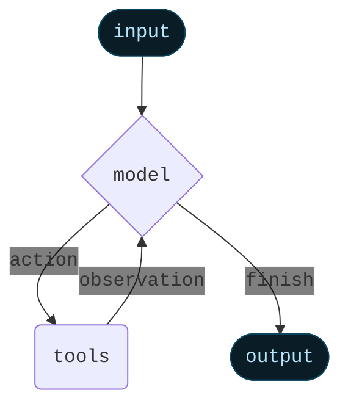

Agent는 language model과 [tool](/oss/javascript/langchain/tools)을 결합하여 작업에 대해 추론하고, 사용할 tool을 결정하며, 반복적으로 솔루션을 향해 작업할 수 있는 시스템을 만듭니다.


`createAgent()`는 프로덕션 준비가 완료된 agent 구현을 제공합니다.


[LLM Agent는 목표를 달성하기 위해 루프에서 tool을 실행합니다](https://simonwillison.net/2025/Sep/18/agents/).
Agent는 중지 조건이 충족될 때까지 실행됩니다 - 즉, model이 최종 출력을 생성하거나 반복 제한에 도달할 때까지입니다.



<Info>


`createAgent()`는 [LangGraph](/oss/javascript/langgraph/overview)를 사용하여 **graph** 기반 agent runtime을 구축합니다. Graph는 agent가 정보를 처리하는 방법을 정의하는 node(단계)와 edge(연결)로 구성됩니다. Agent는 이 graph를 통해 이동하며, model node(model을 호출), tools node(tool을 실행) 또는 middleware와 같은 node를 실행합니다.


[Graph API](/oss/javascript/langgraph/graph-api)에 대해 자세히 알아보세요.

</Info>

## 핵심 구성 요소

### Model

[Model](/oss/javascript/langchain/models)은 agent의 추론 엔진입니다. 정적 및 동적 model 선택을 모두 지원하여 여러 방식으로 지정할 수 있습니다.

#### 정적 model

정적 model은 agent를 생성할 때 한 번 구성되며 실행 중에는 변경되지 않습니다. 이것이 가장 일반적이고 간단한 접근 방식입니다.

<Tooltip tip="`provider:model` 형식을 따르는 문자열 (예: openai:gpt-5)" cta="매핑 보기" href="https://reference.langchain.com/python/langchain/models/#langchain.chat_models.init_chat_model(model_provider)">model identifier string</Tooltip>에서 정적 model을 초기화하려면:


```ts wrap
import { createAgent } from "langchain";

const agent = createAgent({
  model: "openai:gpt-5",
  tools: []
});
```


Model identifier string은 `provider:model` 형식을 사용합니다 (예: `"openai:gpt-5"`). model 구성을 더 세밀하게 제어하려면 provider package를 사용하여 model instance를 직접 초기화할 수 있습니다:

```ts wrap
import { createAgent } from "langchain";
import { ChatOpenAI } from "@langchain/openai";

const model = new ChatOpenAI({
  model: "gpt-4o",
  temperature: 0.1,
  maxTokens: 1000,
  timeout: 30
});

const agent = createAgent({
  model,
  tools: []
});
```

Model instance는 구성에 대한 완전한 제어를 제공합니다. `temperature`, `max_tokens`, `timeouts`와 같은 특정 parameter를 설정하거나 API key, `base_url` 및 기타 provider별 설정을 구성해야 할 때 사용하세요. model에서 사용 가능한 param 및 method를 보려면 [API reference](/oss/javascript/integrations/providers/)를 참조하세요.


#### 동적 model

동적 model은 현재 <Tooltip tip="Agent의 실행 중에 지속되는 불변 구성 및 컨텍스트 데이터를 포함하는 agent의 실행 환경 (예: 사용자 ID, 세션 세부 정보 또는 애플리케이션별 구성).">runtime</Tooltip>에서 현재 <Tooltip tip="메시지, 사용자 정의 필드 및 처리 중에 추적되고 잠재적으로 수정되어야 하는 모든 정보를 포함하여 agent의 실행을 통해 흐르는 데이터 (예: 사용자 기본 설정 또는 tool 사용 통계).">state</Tooltip>와 context를 기반으로 선택됩니다. 이를 통해 정교한 라우팅 로직과 비용 최적화가 가능합니다.


동적 model을 사용하려면 request에서 model을 수정하는 `wrapModelCall`을 사용하여 middleware를 생성하세요:

```ts
import { ChatOpenAI } from "@langchain/openai";
import { createAgent, createMiddleware } from "langchain";

const basicModel = new ChatOpenAI({ model: "gpt-4o-mini" });
const advancedModel = new ChatOpenAI({ model: "gpt-4o" });

const dynamicModelSelection = createMiddleware({
  name: "DynamicModelSelection",
  wrapModelCall: (request, handler) => {
    // Choose model based on conversation complexity
    const messageCount = request.messages.length;

    return handler({
        ...request,
        model: messageCount > 10 ? advancedModel : basicModel,
    });
  },
});

const agent = createAgent({
  model: "gpt-4o-mini", // Base model (used when messageCount ≤ 10)
  tools,
  middleware: [dynamicModelSelection] as const,
});
```

middleware 및 고급 패턴에 대한 자세한 내용은 [middleware documentation](/oss/javascript/langchain/middleware)을 참조하세요.


<Tip>
Model 구성 세부 정보는 [Models](/oss/javascript/langchain/models)를 참조하세요. 동적 model 선택 패턴은 [Dynamic model in middleware](/oss/javascript/langchain/middleware#dynamic-model)를 참조하세요.
</Tip>

### Tools

Tool은 agent에게 작업을 수행할 수 있는 능력을 제공합니다. Agent는 다음을 촉진하여 단순한 model 전용 tool binding을 넘어섭니다:

- 순차적으로 여러 tool 호출 (단일 prompt에 의해 트리거됨)
- 적절한 경우 병렬 tool 호출
- 이전 결과를 기반으로 한 동적 tool 선택
- Tool 재시도 로직 및 오류 처리
- Tool 호출 간 state 지속성

자세한 내용은 [Tools](/oss/javascript/langchain/tools)를 참조하세요.

#### Tool 정의하기

Agent에 tool 목록을 전달하세요.


```ts wrap
import * as z from "zod";
import { createAgent, tool } from "langchain";

const search = tool(
  ({ query }) => `Results for: ${query}`,
  {
    name: "search",
    description: "Search for information",
    schema: z.object({
      query: z.string().describe("The query to search for"),
    }),
  }
);

const getWeather = tool(
  ({ location }) => `Weather in ${location}: Sunny, 72°F`,
  {
    name: "get_weather",
    description: "Get weather information for a location",
    schema: z.object({
      location: z.string().describe("The location to get weather for"),
    }),
  }
);

const agent = createAgent({
  model: "openai:gpt-4o",
  tools: [search, getWeather],
});
```


빈 tool 목록이 제공되면 agent는 tool 호출 기능 없이 단일 LLM node로 구성됩니다.

#### Tool 오류 처리


Tool 오류 처리 방법을 사용자 정의하려면 사용자 정의 middleware에서 `wrapToolCall` hook을 사용하세요:

```ts wrap
import { createAgent, createMiddleware, ToolMessage } from "langchain";

const handleToolErrors = createMiddleware({
  name: "HandleToolErrors",
  wrapToolCall: (request, handler) => {
    try {
      return handler(request);
    } catch (error) {
      // Return a custom error message to the model
      return new ToolMessage({
        content: `Tool error: Please check your input and try again. (${error})`,
        tool_call_id: request.toolCall.id!,
      });
    }
  },
});

const agent = createAgent({
  model: "openai:gpt-4o",
  tools: [
    /* ... */
  ],
  middleware: [handleToolErrors] as const,
});
```

Agent는 tool이 실패할 때 사용자 정의 오류 메시지와 함께 @[`ToolMessage`]를 반환합니다.


#### ReAct 루프에서의 Tool 사용

Agent는 ReAct("Reasoning + Acting") 패턴을 따르며, 간단한 추론 단계와 타겟팅된 tool 호출을 번갈아 가며 결과 관찰을 후속 결정에 반영하여 최종 답변을 제공할 수 있을 때까지 반복합니다.

<Accordion title="ReAct 루프 예제">
Prompt: 현재 가장 인기 있는 무선 헤드폰을 식별하고 재고를 확인하세요.

```
================================ Human Message =================================

Find the most popular wireless headphones right now and check if they're in stock
```

* **Reasoning**: "인기도는 시간에 민감하므로 제공된 검색 tool을 사용해야 합니다."
* **Acting**: `search_products("wireless headphones")` 호출

```
================================== Ai Message ==================================
Tool Calls:
  search_products (call_abc123)
 Call ID: call_abc123
  Args:
    query: wireless headphones
```
```
================================= Tool Message =================================

Found 5 products matching "wireless headphones". Top 5 results: WH-1000XM5, ...
```

* **Reasoning**: "답변하기 전에 상위 순위 항목의 재고를 확인해야 합니다."
* **Acting**: `check_inventory("WH-1000XM5")` 호출

```
================================== Ai Message ==================================
Tool Calls:
  check_inventory (call_def456)
 Call ID: call_def456
  Args:
    product_id: WH-1000XM5
```
```
================================= Tool Message =================================

Product WH-1000XM5: 10 units in stock
```

* **Reasoning**: "가장 인기 있는 model과 재고 상태를 확인했습니다. 이제 사용자의 질문에 답변할 수 있습니다."
* **Acting**: 최종 답변 생성

```
================================== Ai Message ==================================

I found wireless headphones (model WH-1000XM5) with 10 units in stock...
```
</Accordion>

<Tip>
Tool에 대해 자세히 알아보려면 [Tools](/oss/javascript/langchain/tools)를 참조하세요.
</Tip>

### System prompt

Prompt를 제공하여 agent가 작업에 접근하는 방식을 형성할 수 있습니다. @[`system_prompt`] parameter는 문자열로 제공될 수 있습니다:


```ts wrap
const agent = createAgent({
  model,
  tools,
  systemPrompt: "You are a helpful assistant. Be concise and accurate.",
});
```


@[`system_prompt`]가 제공되지 않으면 agent는 메시지에서 직접 작업을 추론합니다.

#### 동적 system prompt

Runtime context 또는 agent state를 기반으로 system prompt를 수정해야 하는 고급 사용 사례의 경우 [middleware](/oss/javascript/langchain/middleware)를 사용할 수 있습니다.


```typescript wrap
import * as z from "zod";
import { createAgent, dynamicSystemPromptMiddleware } from "langchain";

const contextSchema = z.object({
  userRole: z.enum(["expert", "beginner"]),
});

const agent = createAgent({
  model: "openai:gpt-4o",
  tools: [/* ... */],
  contextSchema,
  middleware: [
    dynamicSystemPromptMiddleware<z.infer<typeof contextSchema>>((state, runtime) => {
      const userRole = runtime.context.userRole || "user";
      const basePrompt = "You are a helpful assistant.";

      if (userRole === "expert") {
        return `${basePrompt} Provide detailed technical responses.`;
      } else if (userRole === "beginner") {
        return `${basePrompt} Explain concepts simply and avoid jargon.`;
      }
      return basePrompt;
    }),
  ],
});

// The system prompt will be set dynamically based on context
const result = await agent.invoke(
  { messages: [{ role: "user", content: "Explain machine learning" }] },
  { context: { userRole: "expert" } }
);
```


<Tip>
메시지 유형 및 형식에 대한 자세한 내용은 [Messages](/oss/javascript/langchain/messages)를 참조하세요. 포괄적인 middleware 문서는 [Middleware](/oss/javascript/langchain/middleware)를 참조하세요.
</Tip>

## 호출

[`State`](/oss/javascript/langgraph/graph-api#state)에 업데이트를 전달하여 agent를 호출할 수 있습니다. 모든 agent는 state에 [메시지 시퀀스](/oss/javascript/langgraph/use-graph-api#messagesstate)를 포함합니다. agent를 호출하려면 새 메시지를 전달하세요:


```typescript
await agent.invoke({
  messages: [{ role: "user", content: "What's the weather in San Francisco?" }],
})
```


Agent에서 단계 및/또는 token을 스트리밍하려면 [streaming](/oss/javascript/langchain/streaming) 가이드를 참조하세요.

그렇지 않으면 agent는 LangGraph [Graph API](/oss/javascript/langgraph/use-graph-api)를 따르며 관련된 모든 method를 지원합니다.

## 고급 개념

### Structured output


경우에 따라 agent가 특정 형식으로 출력을 반환하도록 할 수 있습니다. LangChain은 `responseFormat` parameter를 통해 이를 수행하는 간단하고 보편적인 방법을 제공합니다.

```ts wrap
import * as z from "zod";
import { createAgent } from "langchain";

const ContactInfo = z.object({
  name: z.string(),
  email: z.string(),
  phone: z.string(),
});

const agent = createAgent({
  model: "openai:gpt-4o",
  responseFormat: ContactInfo,
});

const result = await agent.invoke({
  messages: [
    {
      role: "user",
      content: "Extract contact info from: John Doe, john@example.com, (555) 123-4567",
    },
  ],
});

console.log(result.structuredResponse);
// {
//   name: 'John Doe',
//   email: 'john@example.com',
//   phone: '(555) 123-4567'
// }
```

<Tip>
Structured output에 대해 알아보려면 [Structured output](/oss/javascript/langchain/structured-output)을 참조하세요.
</Tip>

### Memory

Agent는 메시지 state를 통해 대화 기록을 자동으로 유지합니다. 대화 중에 추가 정보를 기억하기 위해 사용자 정의 state schema를 사용하도록 agent를 구성할 수도 있습니다.

State에 저장된 정보는 agent의 [단기 기억](/oss/javascript/langchain/short-term-memory)으로 생각할 수 있습니다:


```ts wrap
import * as z from "zod";
import { MessagesZodState } from "@langchain/langgraph";
import { createAgent, type BaseMessage } from "langchain";

const customAgentState = z.object({
  messages: MessagesZodState.shape.messages,
  userPreferences: z.record(z.string(), z.string()),
});

const CustomAgentState = createAgent({
  model: "openai:gpt-4o",
  tools: [],
  stateSchema: customAgentState,
});
```


<Tip>
Memory에 대해 자세히 알아보려면 [Memory](/oss/javascript/concepts/memory)를 참조하세요. 세션 간에 지속되는 장기 기억 구현에 대한 정보는 [Long-term memory](/oss/javascript/langchain/long-term-memory)를 참조하세요.
</Tip>

### Streaming

Agent를 `invoke`로 호출하여 최종 응답을 얻는 방법을 살펴보았습니다. Agent가 여러 단계를 실행하는 경우 시간이 걸릴 수 있습니다. 중간 진행 상황을 표시하려면 메시지가 발생할 때 스트리밍할 수 있습니다.


```ts
const stream = await agent.stream(
  {
    messages: [{
      role: "user",
      content: "Search for AI news and summarize the findings"
    }],
  },
  { streamMode: "values" }
);

for await (const chunk of stream) {
  // Each chunk contains the full state at that point
  const latestMessage = chunk.messages.at(-1);
  if (latestMessage?.content) {
    console.log(`Agent: ${latestMessage.content}`);
  } else if (latestMessage?.tool_calls) {
    const toolCallNames = latestMessage.tool_calls.map((tc) => tc.name);
    console.log(`Calling tools: ${toolCallNames.join(", ")}`);
  }
}
```


<Tip>
Streaming에 대한 자세한 내용은 [Streaming](/oss/javascript/langchain/streaming)을 참조하세요.
</Tip>

### Middleware

[Middleware](/oss/javascript/langchain/middleware)는 실행의 다양한 단계에서 agent 동작을 사용자 정의하기 위한 강력한 확장성을 제공합니다. Middleware를 사용하여 다음을 수행할 수 있습니다:

- Model이 호출되기 전에 state 처리 (예: 메시지 트리밍, context 주입)
- Model의 응답 수정 또는 검증 (예: guardrail, 콘텐츠 필터링)
- 사용자 정의 로직으로 tool 실행 오류 처리
- State 또는 context를 기반으로 동적 model 선택 구현
- 사용자 정의 로깅, 모니터링 또는 분석 추가

Middleware는 agent의 실행 graph에 원활하게 통합되어 핵심 agent 로직을 변경하지 않고도 주요 지점에서 데이터 흐름을 가로채고 수정할 수 있습니다.


<Tip>
`beforeModel`, `afterModel`, `wrapToolCall`과 같은 hook을 포함한 포괄적인 middleware 문서는 [Middleware](/oss/javascript/langchain/middleware)를 참조하세요.
</Tip>

---

<Callout icon="pen-to-square" iconType="regular">
    [Edit the source of this page on GitHub.](https://github.com/langchain-ai/docs/edit/main/src/oss/langchain/agents.mdx)
</Callout>
<Tip icon="terminal" iconType="regular">
    [Connect these docs programmatically](/use-these-docs) to Claude, VSCode, and more via MCP for    real-time answers.
</Tip>
