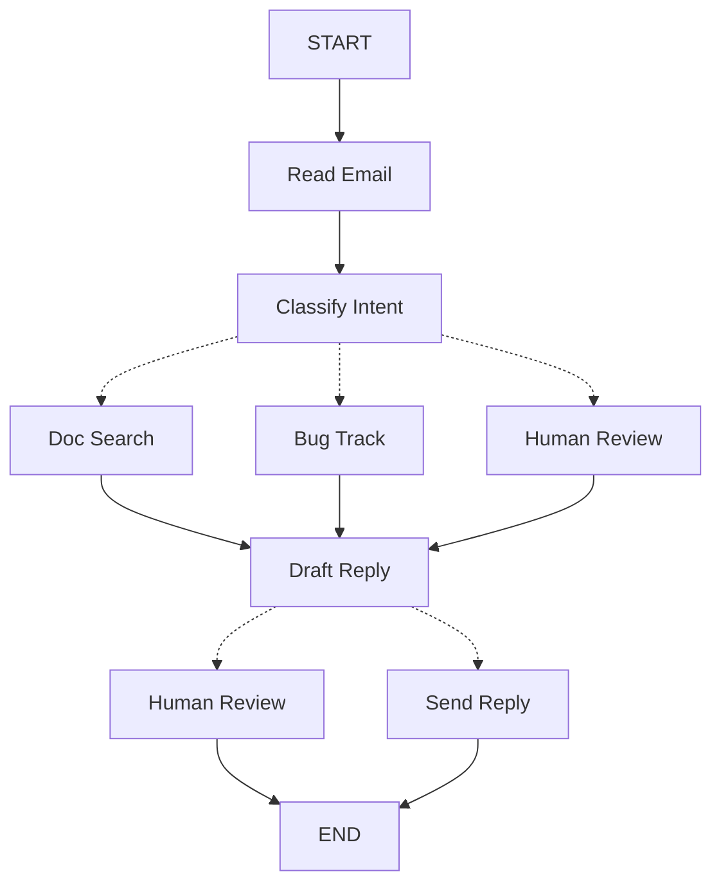

LangGraph는 여러분이 구축하는 에이전트에 대한 사고 방식을 바꿀 수 있습니다. LangGraph로 에이전트를 구축할 때, 먼저 **노드**라고 하는 개별 단계로 분해합니다. 그런 다음 각 노드에 대한 다양한 결정과 전환을 설명합니다. 마지막으로 각 노드가 읽고 쓸 수 있는 공유 **상태**를 통해 노드들을 연결합니다. 이 튜토리얼에서는 LangGraph로 고객 지원 이메일 에이전트를 구축하는 사고 과정을 안내합니다.

## 자동화하려는 프로세스부터 시작하기

고객 지원 이메일을 처리하는 AI 에이전트를 구축해야 한다고 가정해 봅시다. 제품 팀이 다음과 같은 요구사항을 제시했습니다:

에이전트는 다음을 수행해야 합니다:

- 수신된 고객 이메일 읽기
- 긴급도와 주제별로 분류
- 질문에 답변하기 위해 관련 문서 검색
- 적절한 응답 초안 작성
- 복잡한 문제를 담당자에게 에스컬레이션
- 필요시 후속 조치 예약

처리해야 할 예시 시나리오:

1. 간단한 제품 질문: "비밀번호를 재설정하려면 어떻게 해야 하나요?"
2. 버그 리포트: "PDF 형식을 선택하면 내보내기 기능이 충돌합니다"
3. 긴급 결제 문제: "구독료가 두 번 청구되었습니다!"
4. 기능 요청: "모바일 앱에 다크 모드를 추가할 수 있나요?"
5. 복잡한 기술 문제: "API 통합이 504 오류와 함께 간헐적으로 실패합니다"

LangGraph에서 에이전트를 구현하려면 일반적으로 동일한 다섯 단계를 따릅니다.

## 1단계: 워크플로우를 개별 단계로 매핑하기

프로세스의 개별 단계를 식별하는 것부터 시작합니다. 각 단계는 **노드**(특정 작업을 수행하는 함수)가 됩니다. 그런 다음 이러한 단계들이 서로 어떻게 연결되는지 스케치합니다.



화살표는 가능한 경로를 보여주지만, 어떤 경로를 선택할지에 대한 실제 결정은 각 노드 내부에서 발생합니다.

이제 워크플로우의 구성 요소를 식별했으므로 각 노드가 수행해야 하는 작업을 이해해 봅시다:

- Read Email: 이메일 내용 추출 및 파싱
- Classify Intent: LLM을 사용하여 긴급도와 주제를 분류한 다음 적절한 작업으로 라우팅
- Doc Search: 관련 정보를 위해 지식 베이스 쿼리
- Bug Track: 추적 시스템에서 이슈 생성 또는 업데이트
- Draft Reply: 적절한 응답 생성
- Human Review: 승인 또는 처리를 위해 담당자에게 에스컬레이션
- Send Reply: 이메일 응답 발송

<Tip>
일부 노드는 다음에 갈 위치에 대한 결정을 내리고(Classify Intent, Draft Reply, Human Review), 다른 노드는 항상 동일한 다음 단계로 진행합니다(Read Email은 항상 Classify Intent로, Doc Search는 항상 Draft Reply로 이동).
</Tip>

## 2단계: 각 단계가 수행해야 하는 작업 식별하기

그래프의 각 노드에 대해 어떤 유형의 작업을 나타내는지, 제대로 작동하기 위해 어떤 컨텍스트가 필요한지 결정합니다.

<CardGroup cols={2}>
    <Card title="LLM 단계" icon="brain" href="#llm-steps">
        텍스트를 이해, 분석, 생성하거나 추론 결정을 내려야 할 때 사용
    </Card>
    <Card title="데이터 단계" icon="database" href="#data-steps">
        외부 소스에서 정보를 검색해야 할 때 사용
    </Card>
    <Card title="액션 단계" icon="bolt" href="#action-steps">
        외부 작업을 수행해야 할 때 사용
    </Card>
    <Card title="사용자 입력 단계" icon="user" href="#user-input-steps">
        사람의 개입이 필요할 때 사용
    </Card>
</CardGroup>

### LLM 단계

단계에서 텍스트를 이해, 분석, 생성하거나 추론 결정을 내려야 할 때:

<AccordionGroup>
    <Accordion title="Classify Intent 노드">
        - 정적 컨텍스트(프롬프트): 분류 카테고리, 긴급도 정의, 응답 형식
        - 동적 컨텍스트(상태에서): 이메일 내용, 발신자 정보
        - 원하는 결과: 라우팅을 결정하는 구조화된 분류
    </Accordion>

    <Accordion title="Draft Reply 노드">
        - 정적 컨텍스트(프롬프트): 톤 가이드라인, 회사 정책, 응답 템플릿
        - 동적 컨텍스트(상태에서): 분류 결과, 검색 결과, 고객 이력
        - 원하는 결과: 검토 준비가 완료된 전문적인 이메일 응답
    </Accordion>
</AccordionGroup>

### 데이터 단계

단계에서 외부 소스로부터 정보를 검색해야 할 때:

<AccordionGroup>
    <Accordion title="Document Search 노드">
        - 매개변수: 의도와 주제로부터 구축된 쿼리
        - 재시도 전략: 예, 일시적 실패에 대한 지수 백오프 사용
        - 캐싱: API 호출을 줄이기 위해 일반적인 쿼리를 캐시할 수 있음
    </Accordion>

    <Accordion title="Customer History Lookup">
        - 매개변수: 상태에서 가져온 고객 이메일 또는 ID
        - 재시도 전략: 예, 하지만 사용 불가능한 경우 기본 정보로 폴백
        - 캐싱: 예, 신선도와 성능의 균형을 위해 time-to-live 사용
    </Accordion>
</AccordionGroup>

### 액션 단계

단계에서 외부 작업을 수행해야 할 때:

<AccordionGroup>
    <Accordion title="Send Reply 노드">
        - 실행 시점: 승인 후(사람 또는 자동)
        - 재시도 전략: 예, 네트워크 문제에 대한 지수 백오프 사용
        - 캐시하지 않아야 함: 각 발송은 고유한 작업
    </Accordion>

    <Accordion title="Bug Track 노드">
        - 실행 시점: 의도가 "bug"일 때 항상
        - 재시도 전략: 예, 버그 리포트를 잃지 않는 것이 중요
        - 반환값: 응답에 포함할 티켓 ID
    </Accordion>
</AccordionGroup>

### 사용자 입력 단계

단계에서 사람의 개입이 필요할 때:

<AccordionGroup>
    <Accordion title="Human Review 노드">
        - 결정을 위한 컨텍스트: 원본 이메일, 응답 초안, 긴급도, 분류
        - 예상 입력 형식: 승인 boolean과 선택적으로 편집된 응답
        - 트리거 시점: 높은 긴급도, 복잡한 문제 또는 품질 우려
    </Accordion>
</AccordionGroup>

## 3단계: 상태 설계하기

상태는 에이전트의 모든 노드가 접근할 수 있는 공유 [메모리](/oss/javascript/concepts/memory)입니다. 에이전트가 프로세스를 진행하면서 학습하고 결정하는 모든 것을 추적하는 데 사용하는 노트북으로 생각하세요.

### 상태에 무엇이 속하나요?

각 데이터 조각에 대해 다음 질문을 스스로에게 해보세요:

<CardGroup cols={2}>
    <Card title="상태에 포함" icon="check">
        단계 간에 지속되어야 하나요? 그렇다면 상태에 포함됩니다.
    </Card>

    <Card title="저장하지 않음" icon="code">
        다른 데이터로부터 파생할 수 있나요? 그렇다면 상태에 저장하는 대신 필요할 때 계산합니다.
    </Card>
</CardGroup>

이메일 에이전트의 경우 다음을 추적해야 합니다:

- 원본 이메일과 발신자 정보(재구성할 수 없음)
- 분류 결과(여러 다운스트림 노드에서 필요)
- 검색 결과와 고객 데이터(다시 가져오는 데 비용이 많이 듦)
- 응답 초안(검토를 거치는 동안 지속되어야 함)
- 실행 메타데이터(디버깅 및 복구용)

### 상태는 원시 데이터로 유지하고, 프롬프트는 필요할 때 포맷하기

<Tip>
핵심 원칙: 상태는 원시 데이터를 저장해야 하며, 포맷된 텍스트를 저장하지 않습니다. 필요할 때 노드 내부에서 프롬프트를 포맷합니다.
</Tip>

이러한 분리는 다음을 의미합니다:

- 서로 다른 노드가 필요에 따라 동일한 데이터를 다르게 포맷할 수 있음
- 상태 스키마를 수정하지 않고 프롬프트 템플릿을 변경할 수 있음
- 디버깅이 더 명확함 - 각 노드가 받은 데이터를 정확히 볼 수 있음
- 기존 상태를 손상시키지 않고 에이전트를 발전시킬 수 있음

상태를 정의해 봅시다:


```typescript
import * as z from "zod";

// Define the structure for email classification
const EmailClassificationSchema = z.object({
  intent: z.enum(["question", "bug", "billing", "feature", "complex"]),
  urgency: z.enum(["low", "medium", "high", "critical"]),
  topic: z.string(),
  summary: z.string(),
});

const EmailAgentState = z.object({
  // Raw email data
  emailContent: z.string(),
  senderEmail: z.string(),
  emailId: z.string(),

  // Classification result
  classification: EmailClassificationSchema.optional(),

  // Raw search/API results
  searchResults: z.array(z.string()).optional(),  // List of raw document chunks
  customerHistory: z.record(z.any()).optional(),  // Raw customer data from CRM

  // Generated content
  responseText: z.string().optional(),
});

type EmailAgentStateType = z.infer<typeof EmailAgentState>;
type EmailClassificationType = z.infer<typeof EmailClassificationSchema>;
```


상태에는 원시 데이터만 포함되어 있으며 프롬프트 템플릿, 포맷된 문자열, 지시사항은 없습니다. 분류 출력은 LLM에서 직접 가져온 단일 딕셔너리로 저장됩니다.

## 4단계: 노드 구축하기


이제 각 단계를 함수로 구현합니다. LangGraph의 노드는 현재 상태를 받아 업데이트를 반환하는 JavaScript 함수일 뿐입니다.


### 오류를 적절하게 처리하기

서로 다른 오류는 서로 다른 처리 전략이 필요합니다:

| 오류 유형 | 수정 주체 | 전략 | 사용 시점 |
|------------|--------------|----------|-------------|
| 일시적 오류(네트워크 문제, 속도 제한) | 시스템(자동) | 재시도 정책 | 재시도 시 일반적으로 해결되는 일시적 실패 |
| LLM 복구 가능 오류(도구 실패, 파싱 문제) | LLM | 상태에 오류를 저장하고 루프백 | LLM이 오류를 보고 접근 방식을 조정할 수 있음 |
| 사용자 수정 가능 오류(누락된 정보, 불명확한 지시사항) | 사람 | `interrupt()`로 일시 중지 | 진행하려면 사용자 입력이 필요 |
| 예상치 못한 오류 | 개발자 | 버블업 허용 | 디버깅이 필요한 알 수 없는 문제 |

<Tabs>
    <Tab title="일시적 오류" icon="rotate">
        네트워크 문제와 속도 제한을 자동으로 재시도하는 재시도 정책을 추가합니다:


    ```typescript
    import type { RetryPolicy } from "@langchain/langgraph";

    workflow.addNode(
    "searchDocumentation",
    searchDocumentation,
    {
        retryPolicy: { maxAttempts: 3, initialInterval: 1.0 },
    },
    );
    ```


    </Tab>

    <Tab title="LLM 복구 가능" icon="brain">
        LLM이 무엇이 잘못되었는지 보고 다시 시도할 수 있도록 상태에 오류를 저장하고 루프백합니다:


    ```typescript
    import { Command } from "@langchain/langgraph";

    async function executeTool(state: State) {
    try {
        const result = await runTool(state.toolCall);
        return new Command({
        update: { toolResult: result },
        goto: "agent",
        });
    } catch (error) {
        // Let the LLM see what went wrong and try again
        return new Command({
        update: { toolResult: `Tool error: ${error}` },
        goto: "agent"
        });
    }
    }
    ```


    </Tab>

    <Tab title="사용자 수정 가능" icon="user">
        필요할 때(계정 ID, 주문 번호 또는 명확화 등) 사용자로부터 정보를 수집하기 위해 일시 중지합니다:


    ```typescript
    import { Command, interrupt } from "@langchain/langgraph";

    async function lookupCustomerHistory(state: State) {
    if (!state.customerId) {
        const userInput = interrupt({
        message: "Customer ID needed",
        request: "Please provide the customer's account ID to look up their subscription history",
        });
        return new Command({
        update: { customerId: userInput.customerId },
        goto: "lookupCustomerHistory",
        });
    }
    // Now proceed with the lookup
    const customerData = await fetchCustomerHistory(state.customerId);
    return new Command({
        update: { customerHistory: customerData },
        goto: "draftResponse",
    });
    }
    ```


    </Tab>

    <Tab title="예상치 못한" icon="triangle-exclamation">
        디버깅을 위해 버블업하도록 합니다. 처리할 수 없는 것은 캐치하지 마세요:


    ```typescript
    async function sendReply(state: EmailAgentStateType): Promise<void> {
    try {
        await emailService.send(state.responseText);
    } catch (error) {
        throw error;  // Surface unexpected errors
    }
    }
    ```


    </Tab>
</Tabs>


### 이메일 에이전트 노드 구현하기

각 노드를 간단한 함수로 구현합니다. 기억하세요: 노드는 상태를 받아 작업을 수행하고 업데이트를 반환합니다.

<AccordionGroup>
    <Accordion title="읽기 및 분류 노드" icon="brain">


    ```typescript
    import { StateGraph, START, END, Command } from "@langchain/langgraph";
    import { HumanMessage } from "@langchain/core/messages";
    import { ChatAnthropic } from "@langchain/anthropic";

    const llm = new ChatAnthropic({ model: "claude-sonnet-4-5" });

    async function readEmail(state: EmailAgentStateType) {
    // Extract and parse email content
    // In production, this would connect to your email service
    console.log(`Processing email: ${state.emailContent}`);
    return {};
    }

    async function classifyIntent(state: EmailAgentStateType) {
    // Use LLM to classify email intent and urgency, then route accordingly

    // Create structured LLM that returns EmailClassification object
    const structuredLlm = llm.withStructuredOutput(EmailClassificationSchema);

    // Format the prompt on-demand, not stored in state
    const classificationPrompt = `
    Analyze this customer email and classify it:

    Email: ${state.emailContent}
    From: ${state.senderEmail}

    Provide classification including intent, urgency, topic, and summary.
    `;

    // Get structured response directly as object
    const classification = await structuredLlm.invoke(classificationPrompt);

    // Determine next node based on classification
    let nextNode: "searchDocumentation" | "humanReview" | "draftResponse" | "bugTracking";

    if (classification.intent === "billing" || classification.urgency === "critical") {
        nextNode = "humanReview";
    } else if (classification.intent === "question" || classification.intent === "feature") {
        nextNode = "searchDocumentation";
    } else if (classification.intent === "bug") {
        nextNode = "bugTracking";
    } else {
        nextNode = "draftResponse";
    }

    // Store classification as a single object in state
    return new Command({
        update: { classification },
        goto: nextNode,
    });
    }
    ```


    </Accordion>

    <Accordion title="검색 및 추적 노드" icon="database">


    ```typescript
    async function searchDocumentation(state: EmailAgentStateType) {
    // Search knowledge base for relevant information

    // Build search query from classification
    const classification = state.classification!;
    const query = `${classification.intent} ${classification.topic}`;

    let searchResults: string[];

    try {
        // Implement your search logic here
        // Store raw search results, not formatted text
        searchResults = [
        "Reset password via Settings > Security > Change Password",
        "Password must be at least 12 characters",
        "Include uppercase, lowercase, numbers, and symbols",
        ];
    } catch (error) {
        // For recoverable search errors, store error and continue
        searchResults = [`Search temporarily unavailable: ${error}`];
    }

    return new Command({
        update: { searchResults },  // Store raw results or error
        goto: "draftResponse",
    });
    }

    async function bugTracking(state: EmailAgentStateType) {
    // Create or update bug tracking ticket

    // Create ticket in your bug tracking system
    const ticketId = "BUG-12345";  // Would be created via API

    return new Command({
        update: { searchResults: [`Bug ticket ${ticketId} created`] },
        goto: "draftResponse",
    });
    }
    ```


    </Accordion>

    <Accordion title="응답 노드" icon="pen-to-square">


    ```typescript
    import { Command, interrupt } from "@langchain/langgraph";

    async function draftResponse(state: EmailAgentStateType) {
    // Generate response using context and route based on quality

    const classification = state.classification!;

    // Format context from raw state data on-demand
    const contextSections: string[] = [];

    if (state.searchResults) {
        // Format search results for the prompt
        const formattedDocs = state.searchResults.map(doc => `- ${doc}`).join("\n");
        contextSections.push(`Relevant documentation:\n${formattedDocs}`);
    }

    if (state.customerHistory) {
        // Format customer data for the prompt
        contextSections.push(`Customer tier: ${state.customerHistory.tier ?? "standard"}`);
    }

    // Build the prompt with formatted context
    const draftPrompt = `
    Draft a response to this customer email:
    ${state.emailContent}

    Email intent: ${classification.intent}
    Urgency level: ${classification.urgency}

    ${contextSections.join("\n\n")}

    Guidelines:
    - Be professional and helpful
    - Address their specific concern
    - Use the provided documentation when relevant
    `;

    const response = await llm.invoke([new HumanMessage(draftPrompt)]);

    // Determine if human review needed based on urgency and intent
    const needsReview = (
        classification.urgency === "high" ||
        classification.urgency === "critical" ||
        classification.intent === "complex"
    );

    // Route to appropriate next node
    const nextNode = needsReview ? "humanReview" : "sendReply";

    return new Command({
        update: { responseText: response.content.toString() },  // Store only the raw response
        goto: nextNode,
    });
    }

    async function humanReview(state: EmailAgentStateType) {
    // Pause for human review using interrupt and route based on decision
    const classification = state.classification!;

    // interrupt() must come first - any code before it will re-run on resume
    const humanDecision = interrupt({
        emailId: state.emailId,
        originalEmail: state.emailContent,
        draftResponse: state.responseText,
        urgency: classification.urgency,
        intent: classification.intent,
        action: "Please review and approve/edit this response",
    });

    // Now process the human's decision
    if (humanDecision.approved) {
        return new Command({
        update: { responseText: humanDecision.editedResponse || state.responseText },
        goto: "sendReply",
        });
    } else {
        // Rejection means human will handle directly
        return new Command({ update: {}, goto: END });
    }
    }

    async function sendReply(state: EmailAgentStateType): Promise<{}> {
    // Send the email response
    // Integrate with email service
    console.log(`Sending reply: ${state.responseText!.substring(0, 100)}...`);
    return {};
    }
    ```


    </Accordion>
</AccordionGroup>

## 5단계: 연결하기

이제 노드들을 작동하는 그래프로 연결합니다. 노드가 자체 라우팅 결정을 처리하므로 몇 가지 필수 엣지만 필요합니다.

`interrupt()`를 사용한 [human-in-the-loop](/oss/javascript/langgraph/interrupts)를 활성화하려면 실행 간 상태를 저장하기 위해 [checkpointer](/oss/javascript/langgraph/persistence)로 컴파일해야 합니다:

<Accordion title="그래프 컴파일 코드" icon="diagram-project" defaultOpen={true}>


```typescript
import { MemorySaver, RetryPolicy } from "@langchain/langgraph";

// Create the graph
const workflow = new StateGraph(EmailAgentState)
  // Add nodes with appropriate error handling
  .addNode("readEmail", readEmail)
  .addNode("classifyIntent", classifyIntent)
  // Add retry policy for nodes that might have transient failures
  .addNode(
    "searchDocumentation",
    searchDocumentation,
    { retryPolicy: { maxAttempts: 3 } },
  )
  .addNode("bugTracking", bugTracking)
  .addNode("draftResponse", draftResponse)
  .addNode("humanReview", humanReview)
  .addNode("sendReply", sendReply)
  // Add only the essential edges
  .addEdge(START, "readEmail")
  .addEdge("readEmail", "classifyIntent")
  .addEdge("sendReply", END);

// Compile with checkpointer for persistence
const memory = new MemorySaver();
const app = workflow.compile({ checkpointer: memory });
```


</Accordion>


그래프 구조는 최소한입니다. 라우팅이 `Command` 객체를 통해 노드 내부에서 발생하기 때문입니다. 각 노드는 갈 수 있는 위치를 선언하므로 흐름이 명시적이고 추적 가능합니다.


### 에이전트 사용해보기

사람의 검토가 필요한 긴급 결제 문제로 에이전트를 실행해 봅시다:

<Accordion title="에이전트 테스트" icon="flask">


```typescript
// Test with an urgent billing issue
const initialState: EmailAgentStateType = {
  emailContent: "I was charged twice for my subscription! This is urgent!",
  senderEmail: "customer@example.com",
  emailId: "email_123"
};

// Run with a thread_id for persistence
const config = { configurable: { thread_id: "customer_123" } };
const result = await app.invoke(initialState, config);
// The graph will pause at human_review
console.log(`Draft ready for review: ${result.responseText?.substring(0, 100)}...`);

// When ready, provide human input to resume
import { Command } from "@langchain/langgraph";

const humanResponse = new Command({
  resume: {
    approved: true,
    editedResponse: "We sincerely apologize for the double charge. I've initiated an immediate refund...",
  }
});

// Resume execution
const finalResult = await app.invoke(humanResponse, config);
console.log("Email sent successfully!");
```


</Accordion>

그래프는 `interrupt()`에 도달하면 일시 중지되고, 모든 것을 checkpointer에 저장하고 대기합니다. 며칠 후에도 재개할 수 있으며, 중단된 지점에서 정확히 이어집니다. `thread_id`는 이 대화의 모든 상태가 함께 보존되도록 보장합니다.

## 요약 및 다음 단계

### 핵심 인사이트

이 이메일 에이전트를 구축하면서 LangGraph 사고 방식을 보여주었습니다:

<CardGroup cols={2}>
    <Card title="개별 단계로 분해" icon="sitemap" href="#step-1-map-out-your-workflow-as-discrete-steps">
        각 노드는 한 가지를 잘 수행합니다. 이러한 분해는 스트리밍 진행 업데이트, 일시 중지 및 재개가 가능한 내구성 있는 실행, 단계 간 상태를 검사할 수 있어 명확한 디버깅을 가능하게 합니다.
    </Card>

    <Card title="상태는 공유 메모리" icon="database" href="#step-3-design-your-state">
        포맷된 텍스트가 아닌 원시 데이터를 저장합니다. 이를 통해 서로 다른 노드가 동일한 정보를 다른 방식으로 사용할 수 있습니다.
    </Card>

    <Card title="노드는 함수" icon="code" href="#step-4-build-your-nodes">
        상태를 받아 작업을 수행하고 업데이트를 반환합니다. 라우팅 결정을 내려야 할 때 상태 업데이트와 다음 목적지를 모두 지정합니다.
    </Card>

    <Card title="오류는 흐름의 일부" icon="triangle-exclamation" href="#handle-errors-appropriately">
        일시적 실패는 재시도되고, LLM 복구 가능 오류는 컨텍스트와 함께 루프백되며, 사용자 수정 가능 문제는 입력을 위해 일시 중지되고, 예상치 못한 오류는 디버깅을 위해 버블업됩니다.
    </Card>

    <Card title="사람 입력은 일급 시민" icon="user" href="/oss/javascript/langgraph/interrupts">
        `interrupt()` 함수는 실행을 무기한 일시 중지하고, 모든 상태를 저장하며, 입력을 제공하면 중단된 지점에서 정확히 재개됩니다. 노드의 다른 작업과 결합될 때는 먼저 와야 합니다.
    </Card>

    <Card title="그래프 구조는 자연스럽게 나타남" icon="diagram-project" href="#step-5-wire-it-together">
        필수 연결을 정의하면 노드가 자체 라우팅 로직을 처리합니다. 이를 통해 제어 흐름이 명시적이고 추적 가능하게 유지됩니다. 현재 노드를 보면 에이전트가 다음에 무엇을 할지 항상 이해할 수 있습니다.
    </Card>
</CardGroup>

### 고급 고려사항

<Accordion title="노드 세분성 트레이드오프" icon="sliders">
<Info>
이 섹션에서는 노드 세분성 설계의 트레이드오프를 탐구합니다. 대부분의 애플리케이션은 이를 건너뛰고 위에 표시된 패턴을 사용할 수 있습니다.
</Info>

궁금할 수 있습니다: `Read Email`과 `Classify Intent`를 하나의 노드로 결합하지 않는 이유는 무엇일까요?

또는 Doc Search를 Draft Reply와 분리하는 이유는 무엇일까요?

답은 복원력과 관찰 가능성 간의 트레이드오프와 관련이 있습니다.

**복원력 고려사항:** LangGraph의 [내구성 있는 실행](/oss/javascript/langgraph/durable-execution)은 노드 경계에서 체크포인트를 생성합니다. 중단 또는 실패 후 워크플로우가 재개되면 실행이 중지된 노드의 시작 부분부터 시작됩니다. 노드가 작을수록 체크포인트가 더 자주 생성되며, 이는 문제가 발생했을 때 반복해야 할 작업이 줄어든다는 것을 의미합니다. 여러 작업을 하나의 큰 노드로 결합하면 끝 부분 근처에서 실패가 발생할 경우 해당 노드의 시작 부분부터 모든 것을 다시 실행해야 합니다.

이메일 에이전트에 대해 이러한 분해를 선택한 이유:

- **외부 서비스의 격리:** Doc Search와 Bug Track은 외부 API를 호출하기 때문에 별도의 노드입니다. 검색 서비스가 느리거나 실패하면 LLM 호출과 격리하고 싶습니다. 다른 노드에 영향을 주지 않고 이러한 특정 노드에 재시도 정책을 추가할 수 있습니다.

- **중간 가시성:** `Classify Intent`를 자체 노드로 두면 조치를 취하기 전에 LLM이 결정한 내용을 검사할 수 있습니다. 이는 디버깅 및 모니터링에 유용합니다. 에이전트가 언제 왜 사람 검토로 라우팅되는지 정확히 볼 수 있습니다.

- **다른 실패 모드:** LLM 호출, 데이터베이스 조회, 이메일 발송은 서로 다른 재시도 전략을 가집니다. 별도의 노드를 사용하면 이를 독립적으로 구성할 수 있습니다.

- **재사용성 및 테스트:** 작은 노드는 격리된 상태에서 테스트하고 다른 워크플로우에서 재사용하기가 더 쉽습니다.

다른 유효한 접근 방식: `Read Email`과 `Classify Intent`를 단일 노드로 결합할 수 있습니다. 분류 전에 원시 이메일을 검사하는 기능을 잃게 되고 해당 노드의 실패 시 두 작업을 모두 반복하게 됩니다. 대부분의 애플리케이션에서는 별도 노드의 관찰 가능성 및 디버깅 이점이 트레이드오프의 가치가 있습니다.

애플리케이션 수준 고려사항: 2단계의 캐싱 논의(검색 결과를 캐시할지 여부)는 LangGraph 프레임워크 기능이 아닌 애플리케이션 수준 결정입니다. 특정 요구사항에 따라 노드 함수 내에서 캐싱을 구현합니다. LangGraph는 이를 규정하지 않습니다.

성능 고려사항: 노드가 많다고 해서 실행이 느려지는 것은 아닙니다. LangGraph는 기본적으로 백그라운드에서 체크포인트를 작성하므로([비동기 내구성 모드](/oss/javascript/langgraph/durable-execution#durability-modes)), 그래프는 체크포인트가 완료될 때까지 기다리지 않고 계속 실행됩니다. 이는 최소한의 성능 영향으로 빈번한 체크포인트를 얻을 수 있음을 의미합니다. 필요한 경우 이 동작을 조정할 수 있습니다. 완료 시에만 체크포인트하려면 `"exit"` 모드를 사용하거나, 각 체크포인트가 작성될 때까지 실행을 차단하려면 `"sync"` 모드를 사용합니다.
</Accordion>

### 다음 단계

이것은 LangGraph로 에이전트를 구축하는 사고 방식에 대한 소개였습니다. 이 기초를 다음과 같이 확장할 수 있습니다:

<CardGroup cols={2}>
    <Card title="Human-in-the-loop 패턴" icon="user-check" href="/oss/javascript/langgraph/interrupts">
        실행 전 도구 승인, 일괄 승인 및 기타 패턴을 추가하는 방법을 배우세요
    </Card>

    <Card title="서브그래프" icon="diagram-nested" href="/oss/javascript/langgraph/use-subgraphs">
        복잡한 다단계 작업을 위한 서브그래프 생성
    </Card>

    <Card title="스트리밍" icon="tower-broadcast" href="/oss/javascript/langgraph/streaming">
        사용자에게 실시간 진행 상황을 표시하기 위한 스트리밍 추가
    </Card>

    <Card title="관찰 가능성" icon="chart-line" href="/oss/javascript/langgraph/observability">
        디버깅 및 모니터링을 위해 LangSmith로 관찰 가능성 추가
    </Card>

    <Card title="도구 통합" icon="wrench" href="/oss/javascript/langchain/tools">
        웹 검색, 데이터베이스 쿼리 및 API 호출을 위한 더 많은 도구 통합
    </Card>

    <Card title="재시도 로직" icon="rotate" href="/oss/javascript/langgraph/use-graph-api#add-retry-policies">
        실패한 작업에 대한 지수 백오프를 사용한 재시도 로직 구현
    </Card>
</CardGroup>

---

<Callout icon="pen-to-square" iconType="regular">
    [Edit the source of this page on GitHub.](https://github.com/langchain-ai/docs/edit/main/src/oss/langgraph/thinking-in-langgraph.mdx)
</Callout>
<Tip icon="terminal" iconType="regular">
    [Connect these docs programmatically](/use-these-docs) to Claude, VSCode, and more via MCP for    real-time answers.
</Tip>
