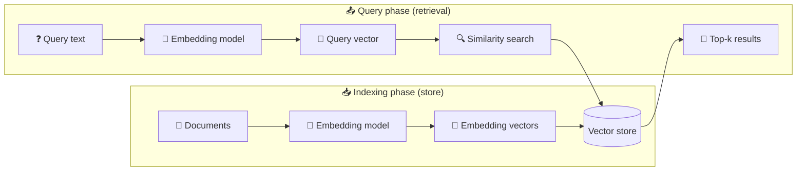

## 개요

벡터 스토어는 [임베딩](/oss/python/integrations/text_embedding)된 데이터를 저장하고 유사도 검색을 수행합니다.



### 인터페이스

LangChain은 벡터 스토어에 대한 통합 인터페이스를 제공하여 다음을 수행할 수 있습니다:

- `add_documents` - 문서를 스토어에 추가합니다.
- `delete` - ID로 저장된 문서를 제거합니다.
- `similarity_search` - 의미적으로 유사한 문서를 조회합니다.

이 추상화로 인해 애플리케이션 로직을 변경하지 않고도 다양한 구현 간에 전환할 수 있습니다.

### 초기화

벡터 스토어를 초기화하려면 임베딩 모델을 제공하세요:

```python
from langchain_core.vectorstores import InMemoryVectorStore
vector_store = InMemoryVectorStore(embedding=SomeEmbeddingModel())
```

### 문서 추가

[`Document`](https://reference.langchain.com/python/langchain_core/documents/#langchain_core.documents.base.Document) 객체(`page_content` 및 선택적 metadata 포함)를 다음과 같이 추가합니다:

```python
vector_store.add_documents(documents=[doc1, doc2], ids=["id1", "id2"])
```

### 문서 삭제

ID를 지정하여 삭제합니다:

```python
vector_store.delete(ids=["id1"])
```

### 유사도 검색

`similarity_search`를 사용해 의미적 쿼리를 실행하면 가장 가까운 임베딩 문서가 반환됩니다:

```python
similar_docs = vector_store.similarity_search("your query here")
```

많은 벡터 스토어가 다음과 같은 매개변수를 지원합니다:

* `k` — 반환할 결과 개수
* `filter` — metadata 기반 조건부 필터링

### 유사도 지표 및 인덱싱

임베딩 유사도는 다음을 사용해 계산될 수 있습니다:

* Cosine similarity
* Euclidean distance
* Dot product

효율적인 검색을 위해 HNSW (Hierarchical Navigable Small World)와 같은 인덱싱 방법을 사용하는 경우가 많지만, 세부 사항은 벡터 스토어에 따라 다릅니다.

### 메타데이터 필터링

metadata(예: source, date)로 필터링하면 검색 결과를 정교화할 수 있습니다:

```python
vector_store.similarity_search(
  "query",
  k=3,
  filter={"source": "tweets"}
)
```

<important>
metadata 기반 필터링 지원은 구현마다 다릅니다.
선택한 벡터 스토어의 문서를 확인하세요.
</important>


## 주요 통합

임베딩 모델 선택:

<AccordionGroup>
<Accordion title="OpenAI">

<CodeGroup>
```bash pip
pip install -qU langchain-openai
```

```bash uv
uv add langchain-openai
```
</CodeGroup>
```python
import getpass
import os

if not os.environ.get("OPENAI_API_KEY"):
  os.environ["OPENAI_API_KEY"] = getpass.getpass("Enter API key for OpenAI: ")

from langchain_openai import OpenAIEmbeddings

embeddings = OpenAIEmbeddings(model="text-embedding-3-large")
```
</Accordion>
<Accordion title="Azure">
```bash
pip install -qU "langchain[azure]"
```
```python
import getpass
import os

if not os.environ.get("AZURE_OPENAI_API_KEY"):
  os.environ["AZURE_OPENAI_API_KEY"] = getpass.getpass("Enter API key for Azure: ")

from langchain_openai import AzureOpenAIEmbeddings

embeddings = AzureOpenAIEmbeddings(
    azure_endpoint=os.environ["AZURE_OPENAI_ENDPOINT"],
    azure_deployment=os.environ["AZURE_OPENAI_DEPLOYMENT_NAME"],
    openai_api_version=os.environ["AZURE_OPENAI_API_VERSION"],
)
```
</Accordion>
<Accordion title="Google Gemini">
```bash
pip install -qU langchain-google-genai
```
```python
import getpass
import os

if not os.environ.get("GOOGLE_API_KEY"):
  os.environ["GOOGLE_API_KEY"] = getpass.getpass("Enter API key for Google Gemini: ")

from langchain_google_genai import GoogleGenerativeAIEmbeddings

embeddings = GoogleGenerativeAIEmbeddings(model="models/gemini-embedding-001")
```
</Accordion>
<Accordion title="Google Vertex">
```bash
pip install -qU langchain-google-vertexai
```
```python
from langchain_google_vertexai import VertexAIEmbeddings

embeddings = VertexAIEmbeddings(model="text-embedding-005")
```
</Accordion>
<Accordion title="AWS">
```bash
pip install -qU langchain-aws
```
```python
from langchain_aws import BedrockEmbeddings

embeddings = BedrockEmbeddings(model_id="amazon.titan-embed-text-v2:0")
```
</Accordion>
<Accordion title="HuggingFace">
```bash
pip install -qU langchain-huggingface
```
```python
from langchain_huggingface import HuggingFaceEmbeddings

embeddings = HuggingFaceEmbeddings(model_name="sentence-transformers/all-mpnet-base-v2")
```
</Accordion>
<Accordion title="Ollama">
```bash
pip install -qU langchain-ollama
```
```python
from langchain_ollama import OllamaEmbeddings

embeddings = OllamaEmbeddings(model="llama3")
```
</Accordion>
<Accordion title="Cohere">
```bash
pip install -qU langchain-cohere
```
```python
import getpass
import os

if not os.environ.get("COHERE_API_KEY"):
  os.environ["COHERE_API_KEY"] = getpass.getpass("Enter API key for Cohere: ")

from langchain_cohere import CohereEmbeddings

embeddings = CohereEmbeddings(model="embed-english-v3.0")
```
</Accordion>
<Accordion title="Mistral AI">
```bash
pip install -qU langchain-mistralai
```
```python
import getpass
import os

if not os.environ.get("MISTRALAI_API_KEY"):
  os.environ["MISTRALAI_API_KEY"] = getpass.getpass("Enter API key for MistralAI: ")

from langchain_mistralai import MistralAIEmbeddings

embeddings = MistralAIEmbeddings(model="mistral-embed")
```
</Accordion>
<Accordion title="Nomic">
```bash
pip install -qU langchain-nomic
```
```python
import getpass
import os

if not os.environ.get("NOMIC_API_KEY"):
  os.environ["NOMIC_API_KEY"] = getpass.getpass("Enter API key for Nomic: ")

from langchain_nomic import NomicEmbeddings

embeddings = NomicEmbeddings(model="nomic-embed-text-v1.5")
```
</Accordion>
<Accordion title="NVIDIA">
```bash
pip install -qU langchain-nvidia-ai-endpoints
```
```python
import getpass
import os

if not os.environ.get("NVIDIA_API_KEY"):
  os.environ["NVIDIA_API_KEY"] = getpass.getpass("Enter API key for NVIDIA: ")

from langchain_nvidia_ai_endpoints import NVIDIAEmbeddings

embeddings = NVIDIAEmbeddings(model="NV-Embed-QA")
```
</Accordion>
<Accordion title="Voyage AI">
```bash
pip install -qU langchain-voyageai
```
```python
import getpass
import os

if not os.environ.get("VOYAGE_API_KEY"):
  os.environ["VOYAGE_API_KEY"] = getpass.getpass("Enter API key for Voyage AI: ")

from langchain-voyageai import VoyageAIEmbeddings

embeddings = VoyageAIEmbeddings(model="voyage-3")
```
</Accordion>
<Accordion title="IBM watsonx">
```bash
pip install -qU langchain-ibm
```
```python
import getpass
import os

if not os.environ.get("WATSONX_APIKEY"):
  os.environ["WATSONX_APIKEY"] = getpass.getpass("Enter API key for IBM watsonx: ")

from langchain_ibm import WatsonxEmbeddings

embeddings = WatsonxEmbeddings(
    model_id="ibm/slate-125m-english-rtrvr",
    url="https://us-south.ml.cloud.ibm.com",
    project_id="<WATSONX PROJECT_ID>",
)
```
</Accordion>
<Accordion title="Fake">
```bash
pip install -qU langchain-core
```
```python
from langchain_core.embeddings import DeterministicFakeEmbedding

embeddings = DeterministicFakeEmbedding(size=4096)
```
</Accordion>
<Accordion title="xAI">
```bash
pip install -qU "langchain[langchain-xai]"
```
```python
import getpass
import os

if not os.environ.get("XAI_API_KEY"):
  os.environ["XAI_API_KEY"] = getpass.getpass("Enter API key for xAI: ")

from langchain.chat_models import init_chat_model

model = init_chat_model("grok-2", model_provider="xai")
```
</Accordion>
<Accordion title="Perplexity">
```bash
pip install -qU "langchain[langchain-perplexity]"
```
```python
import getpass
import os

if not os.environ.get("PPLX_API_KEY"):
  os.environ["PPLX_API_KEY"] = getpass.getpass("Enter API key for Perplexity: ")

from langchain.chat_models import init_chat_model

model = init_chat_model("llama-3.1-sonar-small-128k-online", model_provider="perplexity")
```
</Accordion>
<Accordion title="DeepSeek">
```bash
pip install -qU "langchain[langchain-deepseek]"
```
```python
import getpass
import os

if not os.environ.get("DEEPSEEK_API_KEY"):
  os.environ["DEEPSEEK_API_KEY"] = getpass.getpass("Enter API key for DeepSeek: ")

from langchain.chat_models import init_chat_model

model = init_chat_model("deepseek-chat", model_provider="deepseek")
```
</Accordion>
</AccordionGroup>

벡터 스토어 선택:

<AccordionGroup>
<Accordion title="인메모리">

<CodeGroup>
```bash pip
pip install -qU langchain-core
```

```bash uv
uv add langchain-core
```
</CodeGroup>
```python
from langchain_core.vectorstores import InMemoryVectorStore

vector_store = InMemoryVectorStore(embeddings)
```
</Accordion>
<Accordion title="AstraDB">

<CodeGroup>
```bash pip
pip install -qU langchain-astradb
```

```bash uv
uv add langchain-astradb
```
</CodeGroup>
```python
from langchain_astradb import AstraDBVectorStore

vector_store = AstraDBVectorStore(
    embedding=embeddings,
    api_endpoint=ASTRA_DB_API_ENDPOINT,
    collection_name="astra_vector_langchain",
    token=ASTRA_DB_APPLICATION_TOKEN,
    namespace=ASTRA_DB_NAMESPACE,
)
```
</Accordion>
<Accordion title="Azure Cosmos DB NoSQL">

<CodeGroup>
```bash pip
pip install -qU langchain-azure-ai azure-cosmos
```

```bash uv
uv add langchain-azure-ai
```
</CodeGroup>

```python
from langchain_azure_ai.vectorstores.azure_cosmos_db_no_sql import (
    AzureCosmosDBNoSqlVectorSearch,
)
vector_search = AzureCosmosDBNoSqlVectorSearch.from_documents(
    documents=docs,
    embedding=openai_embeddings,
    cosmos_client=cosmos_client,
    database_name=database_name,
    container_name=container_name,
    vector_embedding_policy=vector_embedding_policy,
    full_text_policy=full_text_policy,
    indexing_policy=indexing_policy,
    cosmos_container_properties=cosmos_container_properties,
    cosmos_database_properties={},
    full_text_search_enabled=True,
)
```
</Accordion>
<Accordion title="Azure Cosmos DB Mongo vCore">

<CodeGroup>
```bash pip
pip install -qU langchain-azure-ai pymongo
```

```bash uv
uv add pymongo
```
</CodeGroup>

```python
from langchain_azure_ai.vectorstores.azure_cosmos_db_mongo_vcore import (
    AzureCosmosDBMongoVCoreVectorSearch,
)

vectorstore = AzureCosmosDBMongoVCoreVectorSearch.from_documents(
    docs,
    openai_embeddings,
    collection=collection,
    index_name=INDEX_NAME,
)
```
</Accordion>
<Accordion title="Chroma">

<CodeGroup>
```bash pip
pip install -qU langchain-chroma
```

```bash uv
uv add langchain-chroma
```
</CodeGroup>
```python
from langchain_chroma import Chroma

vector_store = Chroma(
    collection_name="example_collection",
    embedding_function=embeddings,
    persist_directory="./chroma_langchain_db",  # Where to save data locally, remove if not necessary
)
```
</Accordion>
<Accordion title="FAISS">
```bash
pip install -qU langchain-community
```
```python
import faiss
from langchain_community.docstore.in_memory import InMemoryDocstore
from langchain_community.vectorstores import FAISS

embedding_dim = len(embeddings.embed_query("hello world"))
index = faiss.IndexFlatL2(embedding_dim)

vector_store = FAISS(
    embedding_function=embeddings,
    index=index,
    docstore=InMemoryDocstore(),
    index_to_docstore_id={},
)
```
</Accordion>
<Accordion title="Milvus">

<CodeGroup>
```bash pip
pip install -qU langchain-milvus
```

```bash uv
uv add langchain-milvus
```
</CodeGroup>
```python
from langchain_milvus import Milvus

URI = "./milvus_example.db"

vector_store = Milvus(
    embedding_function=embeddings,
    connection_args={"uri": URI},
    index_params={"index_type": "FLAT", "metric_type": "L2"},
)
```
</Accordion>
<Accordion title="MongoDB">
```bash
pip install -qU langchain-mongodb
```
```python
from langchain_mongodb import MongoDBAtlasVectorSearch

vector_store = MongoDBAtlasVectorSearch(
    embedding=embeddings,
    collection=MONGODB_COLLECTION,
    index_name=ATLAS_VECTOR_SEARCH_INDEX_NAME,
    relevance_score_fn="cosine",
)
```
</Accordion>
<Accordion title="PGVector">

<CodeGroup>
```bash pip
pip install -qU langchain-postgres
```

```bash uv
uv add langchain-postgres
```
</CodeGroup>
```python
from langchain_postgres import PGVector

vector_store = PGVector(
    embeddings=embeddings,
    collection_name="my_docs",
    connection="postgresql+psycopg://..."
)
```
</Accordion>
<Accordion title="PGVectorStore">

<CodeGroup>
```bash pip
pip install -qU langchain-postgres
```

```bash uv
uv add langchain-postgres
```
</CodeGroup>
```python
from langchain_postgres import PGEngine, PGVectorStore

$engine = PGEngine.from_connection_string(
    url="postgresql+psycopg://..."
)

vector_store = PGVectorStore.create_sync(
    engine=pg_engine,
    table_name='test_table',
    embedding_service=embedding
)
```
</Accordion>
<Accordion title="Pinecone">

<CodeGroup>
```bash pip
pip install -qU langchain-pinecone
```

```bash uv
uv add langchain-pinecone
```
</CodeGroup>
```python
from langchain_pinecone import PineconeVectorStore
from pinecone import Pinecone

pc = Pinecone(api_key=...)
index = pc.Index(index_name)

vector_store = PineconeVectorStore(embedding=embeddings, index=index)
```
</Accordion>
<Accordion title="Qdrant">

<CodeGroup>
```bash pip
pip install -qU langchain-qdrant
```

```bash uv
uv add langchain-qdrant
```
</CodeGroup>
```python
from qdrant_client.models import Distance, VectorParams
from langchain_qdrant import QdrantVectorStore
from qdrant_client import QdrantClient

client = QdrantClient(":memory:")

vector_size = len(embeddings.embed_query("sample text"))

if not client.collection_exists("test"):
    client.create_collection(
        collection_name="test",
        vectors_config=VectorParams(size=vector_size, distance=Distance.COSINE)
    )
vector_store = QdrantVectorStore(
    client=client,
    collection_name="test",
    embedding=embeddings,
)
```
</Accordion>
</AccordionGroup>

| 벡터 스토어 | ID로 삭제 | 필터링 | 벡터로 검색 | 점수와 함께 검색 | 비동기 | 표준 테스트 통과 | 멀티 테넌시 | add_documents에서 ID 지정 |
|------------|-------------|-----------|-----------------|------------------|--------|---------------------|---------------|-------------------|
| [`AstraDBVectorStore`](/oss/python/integrations/vectorstores/astradb) | ✅ | ✅ | ✅ | ✅ | ✅ | ❌ | ❌ | ✅ |
| [`AzureCosmosDBNoSqlVectorStore`](/oss/python/integrations/vectorstores/azure_cosmos_db_no_sql) | ✅ | ✅ | ✅ | ✅ | ❌ | ✅ | ✅ | ✅ |
| [`AzureCosmosDBMongoVCoreVectorStore`](/oss/python/integrations/vectorstores/azure_cosmos_db_mongo_vcore) | ✅ | ✅ | ✅ | ✅ | ❌ | ✅ | ✅ | ✅ |
| [`Chroma`](/oss/python/integrations/vectorstores/chroma) | ✅ | ✅ | ✅ | ✅ | ✅ | ✅ | ✅ | ✅ |
| [`Clickhouse`](/oss/python/integrations/vectorstores/clickhouse) | ✅ | ✅ | ❌ | ✅ | ❌ | ❌ | ❌ | ✅ |
| [`CouchbaseSearchVectorStore`](/oss/python/integrations/vectorstores/couchbase) | ✅ | ✅ | ✅ | ✅ | ✅ | ❌ | ✅ | ✅ |
| [`DatabricksVectorSearch`](/oss/python/integrations/vectorstores/databricks_vector_search) | ✅ | ✅ | ✅ | ✅ | ✅ | ❌ | ❌ | ✅ |
| [`ElasticsearchStore`](/oss/python/integrations/vectorstores/elasticsearch) | ✅ | ✅ | ✅ | ✅ | ✅ | ❌ | ❌ | ✅ |
| [`FAISS`](/oss/python/integrations/vectorstores/faiss) | ✅ | ✅ | ✅ | ✅ | ✅ | ❌ | ❌ | ✅ |
| [`InMemoryVectorStore`](https://python.langchain.com/api_reference/core/vectorstores/langchain_core.vectorstores.in_memory.InMemoryVectorStore.html) | ✅ | ✅ | ❌ | ✅ | ✅ | ❌ | ❌ | ✅ |
| [`Milvus`](/oss/python/integrations/vectorstores/milvus) | ✅ | ✅ | ✅ | ✅ | ✅ | ✅ | ✅ | ✅ |
| [`Moorcheh`](/oss/python/integrations/vectorstores/moorcheh) | ✅ | ✅ | ✅ | ✅ | ✅ | ✅ | ✅ | ✅ |
| [`MongoDBAtlasVectorSearch`](/oss/python/integrations/vectorstores/mongodb_atlas) | ✅ | ✅ | ✅ | ✅ | ✅ | ✅ | ✅ | ✅ |
| [`openGauss`](/oss/python/integrations/vectorstores/opengauss) | ✅ | ✅ | ✅ | ✅ | ❌ | ✅ | ❌ | ✅ |
| [`PGVector`](/oss/python/integrations/vectorstores/pgvector) | ✅ | ✅ | ✅ | ✅ | ✅ | ❌ | ❌ | ✅ |
| [`PGVectorStore`](/oss/python/integrations/vectorstores/pgvectorstore) | ✅ | ✅ | ✅ | ✅ | ✅ | ✅ | ❌ | ✅ |
| [`PineconeVectorStore`](/oss/python/integrations/vectorstores/pinecone) | ✅ | ✅ | ✅ | ❌ | ✅ | ❌ | ❌ | ✅ |
| [`QdrantVectorStore`](/oss/python/integrations/vectorstores/qdrant) | ✅ | ✅ | ✅ | ✅ | ✅ | ❌ | ✅ | ✅ |
| [`Weaviate`](/oss/python/integrations/vectorstores/weaviate) | ✅ | ✅ | ✅ | ✅ | ✅ | ❌ | ✅ | ✅ |
| [`SQLServer`](/oss/python/integrations/vectorstores/sqlserver) | ✅ | ✅ | ✅ | ✅ | ❌ | ❌ | ❌ | ✅ |
| [`ZeusDB`](/oss/python/integrations/vectorstores/zeusdb) | ✅ | ✅ | ✅ | ✅ | ✅ | ✅ | ❌ | ✅ |

## 모든 벡터 스토어

<Columns cols={3}>
<Card title="Activeloop Deep Lake" icon="link" href="/oss/python/integrations/vectorstores/activeloop_deeplake" arrow="true" cta="가이드 보기"/>
<Card title="Alibaba Cloud OpenSearch" icon="link" href="/oss/python/integrations/vectorstores/alibabacloud_opensearch" arrow="true" cta="가이드 보기"/>
<Card title="AnalyticDB" icon="link" href="/oss/python/integrations/vectorstores/analyticdb" arrow="true" cta="가이드 보기"/>
<Card title="Annoy" icon="link" href="/oss/python/integrations/vectorstores/annoy" arrow="true" cta="가이드 보기"/>
<Card title="Apache Doris" icon="link" href="/oss/python/integrations/vectorstores/apache_doris" arrow="true" cta="가이드 보기"/>
<Card title="ApertureDB" icon="link" href="/oss/python/integrations/vectorstores/aperturedb" arrow="true" cta="가이드 보기"/>
<Card title="Astra DB Vector Store" icon="link" href="/oss/python/integrations/vectorstores/astradb" arrow="true" cta="가이드 보기"/>
<Card title="Atlas" icon="link" href="/oss/python/integrations/vectorstores/atlas" arrow="true" cta="가이드 보기"/>
<Card title="AwaDB" icon="link" href="/oss/python/integrations/vectorstores/awadb" arrow="true" cta="가이드 보기"/>
<Card title="Azure Cosmos DB Mongo vCore" icon="link" href="/oss/python/integrations/vectorstores/azure_cosmos_db_mongo_vcore" arrow="true" cta="가이드 보기"/>
<Card title="Azure Cosmos DB No SQL" icon="link" href="/oss/python/integrations/vectorstores/azure_cosmos_db_no_sql" arrow="true" cta="가이드 보기"/>
<Card title="Azure AI Search" icon="link" href="/oss/python/integrations/vectorstores/azuresearch" arrow="true" cta="가이드 보기"/>
<Card title="Bagel" icon="link" href="/oss/python/integrations/vectorstores/bagel" arrow="true" cta="가이드 보기"/>
<Card title="BagelDB" icon="link" href="/oss/python/integrations/vectorstores/bageldb" arrow="true" cta="가이드 보기"/>
<Card title="Baidu Cloud ElasticSearch VectorSearch" icon="link" href="/oss/python/integrations/vectorstores/baiducloud_vector_search" arrow="true" cta="가이드 보기"/>
<Card title="Baidu VectorDB" icon="link" href="/oss/python/integrations/vectorstores/baiduvectordb" arrow="true" cta="가이드 보기"/>
<Card title="Apache Cassandra" icon="link" href="/oss/python/integrations/vectorstores/cassandra" arrow="true" cta="가이드 보기"/>
<Card title="Chroma" icon="link" href="/oss/python/integrations/vectorstores/chroma" arrow="true" cta="가이드 보기"/>
<Card title="Clarifai" icon="link" href="/oss/python/integrations/vectorstores/clarifai" arrow="true" cta="가이드 보기"/>
<Card title="ClickHouse" icon="link" href="/oss/python/integrations/vectorstores/clickhouse" arrow="true" cta="가이드 보기"/>
<Card title="Couchbase" icon="link" href="/oss/python/integrations/vectorstores/couchbase" arrow="true" cta="가이드 보기"/>
<Card title="DashVector" icon="link" href="/oss/python/integrations/vectorstores/dashvector" arrow="true" cta="가이드 보기"/>
<Card title="Databricks" icon="link" href="/oss/python/integrations/vectorstores/databricks_vector_search" arrow="true" cta="가이드 보기"/>
<Card title="IBM Db2" icon="link" href="/oss/python/integrations/vectorstores/db2" arrow="true" cta="가이드 보기"/>
<Card title="DingoDB" icon="link" href="/oss/python/integrations/vectorstores/dingo" arrow="true" cta="가이드 보기"/>
<Card title="DocArray HnswSearch" icon="link" href="/oss/python/integrations/vectorstores/docarray_hnsw" arrow="true" cta="가이드 보기"/>
<Card title="DocArray InMemorySearch" icon="link" href="/oss/python/integrations/vectorstores/docarray_in_memory" arrow="true" cta="가이드 보기"/>
<Card title="Amazon Document DB" icon="link" href="/oss/python/integrations/vectorstores/documentdb" arrow="true" cta="가이드 보기"/>
<Card title="DuckDB" icon="link" href="/oss/python/integrations/vectorstores/duckdb" arrow="true" cta="가이드 보기"/>
<Card title="China Mobile ECloud ElasticSearch" icon="link" href="/oss/python/integrations/vectorstores/ecloud_vector_search" arrow="true" cta="가이드 보기"/>
<Card title="Elasticsearch" icon="link" href="/oss/python/integrations/vectorstores/elasticsearch" arrow="true" cta="가이드 보기"/>
<Card title="Epsilla" icon="link" href="/oss/python/integrations/vectorstores/epsilla" arrow="true" cta="가이드 보기"/>
<Card title="Faiss" icon="link" href="/oss/python/integrations/vectorstores/faiss" arrow="true" cta="가이드 보기"/>
<Card title="Faiss (Async)" icon="link" href="/oss/python/integrations/vectorstores/faiss_async" arrow="true" cta="가이드 보기"/>
<Card title="FalkorDB" icon="link" href="/oss/python/integrations/vectorstores/falkordbvector" arrow="true" cta="가이드 보기"/>
<Card title="Gel" icon="link" href="/oss/python/integrations/vectorstores/gel" arrow="true" cta="가이드 보기"/>
<Card title="Google AlloyDB" icon="link" href="/oss/python/integrations/vectorstores/google_alloydb" arrow="true" cta="가이드 보기"/>
<Card title="Google BigQuery Vector Search" icon="link" href="/oss/python/integrations/vectorstores/google_bigquery_vector_search" arrow="true" cta="가이드 보기"/>
<Card title="Google Cloud SQL for MySQL" icon="link" href="/oss/python/integrations/vectorstores/google_cloud_sql_mysql" arrow="true" cta="가이드 보기"/>
<Card title="Google Cloud SQL for PostgreSQL" icon="link" href="/oss/python/integrations/vectorstores/google_cloud_sql_pg" arrow="true" cta="가이드 보기"/>
<Card title="Firestore" icon="link" href="/oss/python/integrations/vectorstores/google_firestore" arrow="true" cta="가이드 보기"/>
<Card title="Google Memorystore for Redis" icon="link" href="/oss/python/integrations/vectorstores/google_memorystore_redis" arrow="true" cta="가이드 보기"/>
<Card title="Google Spanner" icon="link" href="/oss/python/integrations/vectorstores/google_spanner" arrow="true" cta="가이드 보기"/>
<Card title="Google Vertex AI Feature Store" icon="link" href="/oss/python/integrations/vectorstores/google_vertex_ai_feature_store" arrow="true" cta="가이드 보기"/>
<Card title="Google Vertex AI Vector Search" icon="link" href="/oss/python/integrations/vectorstores/google_vertex_ai_vector_search" arrow="true" cta="가이드 보기"/>
<Card title="Hippo" icon="link" href="/oss/python/integrations/vectorstores/hippo" arrow="true" cta="가이드 보기"/>
<Card title="Hologres" icon="link" href="/oss/python/integrations/vectorstores/hologres" arrow="true" cta="가이드 보기"/>
<Card title="Jaguar Vector Database" icon="link" href="/oss/python/integrations/vectorstores/jaguar" arrow="true" cta="가이드 보기"/>
<Card title="Kinetica" icon="link" href="/oss/python/integrations/vectorstores/kinetica" arrow="true" cta="가이드 보기"/>
<Card title="LanceDB" icon="link" href="/oss/python/integrations/vectorstores/lancedb" arrow="true" cta="가이드 보기"/>
<Card title="Lantern" icon="link" href="/oss/python/integrations/vectorstores/lantern" arrow="true" cta="가이드 보기"/>
<Card title="Lindorm" icon="link" href="/oss/python/integrations/vectorstores/lindorm" arrow="true" cta="가이드 보기"/>
<Card title="LLMRails" icon="link" href="/oss/python/integrations/vectorstores/llm_rails" arrow="true" cta="가이드 보기"/>
<Card title="ManticoreSearch" icon="link" href="/oss/python/integrations/vectorstores/manticore_search" arrow="true" cta="가이드 보기"/>
<Card title="MariaDB" icon="link" href="/oss/python/integrations/vectorstores/mariadb" arrow="true" cta="가이드 보기"/>
<Card title="Marqo" icon="link" href="/oss/python/integrations/vectorstores/marqo" arrow="true" cta="가이드 보기"/>
<Card title="Meilisearch" icon="link" href="/oss/python/integrations/vectorstores/meilisearch" arrow="true" cta="가이드 보기"/>
<Card title="Amazon MemoryDB" icon="link" href="/oss/python/integrations/vectorstores/memorydb" arrow="true" cta="가이드 보기"/>
<Card title="Milvus" icon="link" href="/oss/python/integrations/vectorstores/milvus" arrow="true" cta="가이드 보기"/>
<Card title="Momento Vector Index" icon="link" href="/oss/python/integrations/vectorstores/momento_vector_index" arrow="true" cta="가이드 보기"/>
<Card title="Moorcheh" icon="link" href="/oss/python/integrations/vectorstores/moorcheh" arrow="true" cta="가이드 보기"/>
<Card title="MongoDB Atlas" icon="link" href="/oss/python/integrations/vectorstores/mongodb_atlas" arrow="true" cta="가이드 보기"/>
<Card title="MyScale" icon="link" href="/oss/python/integrations/vectorstores/myscale" arrow="true" cta="가이드 보기"/>
<Card title="Neo4j Vector Index" icon="link" href="/oss/python/integrations/vectorstores/neo4jvector" arrow="true" cta="가이드 보기"/>
<Card title="NucliaDB" icon="link" href="/oss/python/integrations/vectorstores/nucliadb" arrow="true" cta="가이드 보기"/>
<Card title="Oceanbase" icon="link" href="/oss/python/integrations/vectorstores/oceanbase" arrow="true" cta="가이드 보기"/>
<Card title="openGauss" icon="link" href="/oss/python/integrations/vectorstores/opengauss" arrow="true" cta="가이드 보기"/>
<Card title="OpenSearch" icon="link" href="/oss/python/integrations/vectorstores/opensearch" arrow="true" cta="가이드 보기"/>
<Card title="Oracle AI Vector Search" icon="link" href="/oss/python/integrations/vectorstores/oracle" arrow="true" cta="가이드 보기"/>
<Card title="Pathway" icon="link" href="/oss/python/integrations/vectorstores/pathway" arrow="true" cta="가이드 보기"/>
<Card title="Postgres Embedding" icon="link" href="/oss/python/integrations/vectorstores/pgembedding" arrow="true" cta="가이드 보기"/>
<Card title="PGVecto.rs" icon="link" href="/oss/python/integrations/vectorstores/pgvecto_rs" arrow="true" cta="가이드 보기"/>
<Card title="PGVector" icon="link" href="/oss/python/integrations/vectorstores/pgvector" arrow="true" cta="가이드 보기"/>
<Card title="PGVectorStore" icon="link" href="/oss/python/integrations/vectorstores/pgvectorstore" arrow="true" cta="가이드 보기"/>
<Card title="Pinecone" icon="link" href="/oss/python/integrations/vectorstores/pinecone" arrow="true" cta="가이드 보기"/>
<Card title="Pinecone (sparse)" icon="link" href="/oss/python/integrations/vectorstores/pinecone_sparse" arrow="true" cta="가이드 보기"/>
<Card title="Qdrant" icon="link" href="/oss/python/integrations/vectorstores/qdrant" arrow="true" cta="가이드 보기"/>
<Card title="Relyt" icon="link" href="/oss/python/integrations/vectorstores/relyt" arrow="true" cta="가이드 보기"/>
<Card title="Rockset" icon="link" href="/oss/python/integrations/vectorstores/rockset" arrow="true" cta="가이드 보기"/>
<Card title="SAP HANA Cloud Vector Engine" icon="link" href="/oss/python/integrations/vectorstores/sap_hanavector" arrow="true" cta="가이드 보기"/>
<Card title="ScaNN" icon="link" href="/oss/python/integrations/vectorstores/scann" arrow="true" cta="가이드 보기"/>
<Card title="SemaDB" icon="link" href="/oss/python/integrations/vectorstores/semadb" arrow="true" cta="가이드 보기"/>
<Card title="SingleStore" icon="link" href="/oss/python/integrations/vectorstores/singlestore" arrow="true" cta="가이드 보기"/>
<Card title="scikit-learn" icon="link" href="/oss/python/integrations/vectorstores/sklearn" arrow="true" cta="가이드 보기"/>
<Card title="SQLiteVec" icon="link" href="/oss/python/integrations/vectorstores/sqlitevec" arrow="true" cta="가이드 보기"/>
<Card title="SQLite-VSS" icon="link" href="/oss/python/integrations/vectorstores/sqlitevss" arrow="true" cta="가이드 보기"/>
<Card title="SQLServer" icon="link" href="/oss/python/integrations/vectorstores/sqlserver" arrow="true" cta="가이드 보기"/>
<Card title="StarRocks" icon="link" href="/oss/python/integrations/vectorstores/starrocks" arrow="true" cta="가이드 보기"/>
<Card title="Supabase" icon="link" href="/oss/python/integrations/vectorstores/supabase" arrow="true" cta="가이드 보기"/>
<Card title="SurrealDB" icon="link" href="/oss/python/integrations/vectorstores/surrealdb" arrow="true" cta="가이드 보기"/>
<Card title="Tablestore" icon="link" href="/oss/python/integrations/vectorstores/tablestore" arrow="true" cta="가이드 보기"/>
<Card title="Tair" icon="link" href="/oss/python/integrations/vectorstores/tair" arrow="true" cta="가이드 보기"/>
<Card title="Tencent Cloud VectorDB" icon="link" href="/oss/python/integrations/vectorstores/tencentvectordb" arrow="true" cta="가이드 보기"/>
<Card title="ThirdAI NeuralDB" icon="link" href="/oss/python/integrations/vectorstores/thirdai_neuraldb" arrow="true" cta="가이드 보기"/>
<Card title="TiDB Vector" icon="link" href="/oss/python/integrations/vectorstores/tidb_vector" arrow="true" cta="가이드 보기"/>
<Card title="Tigris" icon="link" href="/oss/python/integrations/vectorstores/tigris" arrow="true" cta="가이드 보기"/>
<Card title="TileDB" icon="link" href="/oss/python/integrations/vectorstores/tiledb" arrow="true" cta="가이드 보기"/>
<Card title="Timescale Vector" icon="link" href="/oss/python/integrations/vectorstores/timescalevector" arrow="true" cta="가이드 보기"/>
<Card title="Typesense" icon="link" href="/oss/python/integrations/vectorstores/typesense" arrow="true" cta="가이드 보기"/>
<Card title="Upstash Vector" icon="link" href="/oss/python/integrations/vectorstores/upstash" arrow="true" cta="가이드 보기"/>
<Card title="USearch" icon="link" href="/oss/python/integrations/vectorstores/usearch" arrow="true" cta="가이드 보기"/>
<Card title="Vald" icon="link" href="/oss/python/integrations/vectorstores/vald" arrow="true" cta="가이드 보기"/>
<Card title="VDMS" icon="link" href="/oss/python/integrations/vectorstores/vdms" arrow="true" cta="가이드 보기"/>
<Card title="Vearch" icon="link" href="/oss/python/integrations/vectorstores/vearch" arrow="true" cta="가이드 보기"/>
<Card title="Vectara" icon="link" href="/oss/python/integrations/vectorstores/vectara" arrow="true" cta="가이드 보기"/>
<Card title="Vespa" icon="link" href="/oss/python/integrations/vectorstores/vespa" arrow="true" cta="가이드 보기"/>
<Card title="viking DB" icon="link" href="/oss/python/integrations/vectorstores/vikingdb" arrow="true" cta="가이드 보기"/>
<Card title="vlite" icon="link" href="/oss/python/integrations/vectorstores/vlite" arrow="true" cta="가이드 보기"/>
<Card title="Weaviate" icon="link" href="/oss/python/integrations/vectorstores/weaviate" arrow="true" cta="가이드 보기"/>
<Card title="Xata" icon="link" href="/oss/python/integrations/vectorstores/xata" arrow="true" cta="가이드 보기"/>
<Card title="YDB" icon="link" href="/oss/python/integrations/vectorstores/ydb" arrow="true" cta="가이드 보기"/>
<Card title="Yellowbrick" icon="link" href="/oss/python/integrations/vectorstores/yellowbrick" arrow="true" cta="가이드 보기"/>
<Card title="Zep" icon="link" href="/oss/python/integrations/vectorstores/zep" arrow="true" cta="가이드 보기"/>
<Card title="Zep Cloud" icon="link" href="/oss/python/integrations/vectorstores/zep_cloud" arrow="true" cta="가이드 보기"/>
<Card title="ZeusDB" icon="link" href="/oss/python/integrations/vectorstores/zeusdb" arrow="true" cta="가이드 보기"/>
<Card title="Zilliz" icon="link" href="/oss/python/integrations/vectorstores/zilliz" arrow="true" cta="가이드 보기"/>
</Columns>

---

<Callout icon="pen-to-square" iconType="regular">
    [Edit the source of this page on GitHub.](https://github.com/langchain-ai/docs/edit/main/src/oss/python/integrations/vectorstores/index.mdx)
</Callout>
<Tip icon="terminal" iconType="regular">
    [Connect these docs programmatically](/use-these-docs) to Claude, VSCode, and more via MCP for    real-time answers.
</Tip>
