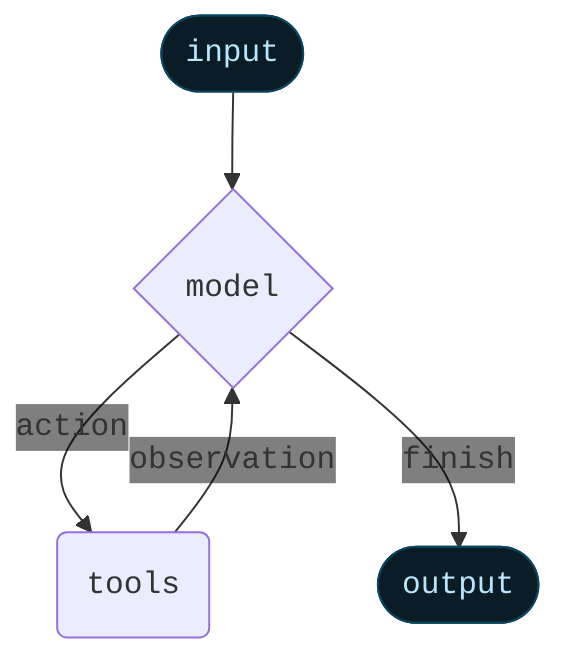

Agent는 language model과 [tool](/oss/python/langchain/tools)을 결합하여 작업에 대해 추론하고, 사용할 tool을 결정하며, 반복적으로 솔루션을 향해 작업할 수 있는 시스템을 만듭니다.

[`create_agent`](https://reference.langchain.com/python/langchain/agents/#langchain.agents.create_agent)는 프로덕션 준비가 완료된 agent 구현을 제공합니다.


[LLM Agent는 목표를 달성하기 위해 루프에서 tool을 실행합니다](https://simonwillison.net/2025/Sep/18/agents/).
Agent는 중지 조건이 충족될 때까지 실행됩니다 - 즉, model이 최종 출력을 생성하거나 반복 제한에 도달할 때까지입니다.



<Info>

[`create_agent`](https://reference.langchain.com/python/langchain/agents/#langchain.agents.create_agent)는 [LangGraph](/oss/python/langgraph/overview)를 사용하여 **graph** 기반 agent runtime을 구축합니다. Graph는 agent가 정보를 처리하는 방법을 정의하는 node(단계)와 edge(연결)로 구성됩니다. Agent는 이 graph를 통해 이동하며, model node(model을 호출), tools node(tool을 실행) 또는 middleware와 같은 node를 실행합니다.


[Graph API](/oss/python/langgraph/graph-api)에 대해 자세히 알아보세요.

</Info>

## 핵심 구성 요소

### Model

[Model](/oss/python/langchain/models)은 agent의 추론 엔진입니다. 정적 및 동적 model 선택을 모두 지원하여 여러 방식으로 지정할 수 있습니다.

#### 정적 model

정적 model은 agent를 생성할 때 한 번 구성되며 실행 중에는 변경되지 않습니다. 이것이 가장 일반적이고 간단한 접근 방식입니다.

<Tooltip tip="`provider:model` 형식을 따르는 문자열 (예: openai:gpt-5)" cta="매핑 보기" href="https://reference.langchain.com/python/langchain/models/#langchain.chat_models.init_chat_model(model_provider)">model identifier string</Tooltip>에서 정적 model을 초기화하려면:

```python wrap
from langchain.agents import create_agent

agent = create_agent(
    "openai:gpt-5",
    tools=tools
)
```


<Tip>
    Model identifier string은 자동 추론을 지원합니다 (예: `"gpt-5"`는 `"openai:gpt-5"`로 추론됨). model identifier string 매핑의 전체 목록을 보려면 [reference](https://reference.langchain.com/python/langchain/models/#langchain.chat_models.init_chat_model(model_provider))를 참조하세요.
</Tip>

Model 구성을 더 세밀하게 제어하려면 provider package를 사용하여 model instance를 직접 초기화하세요. 이 예제에서는 [`ChatOpenAI`](https://reference.langchain.com/python/integrations/langchain_openai/ChatOpenAI/)를 사용합니다. 사용 가능한 다른 chat model class는 [Chat models](/oss/python/integrations/chat)를 참조하세요.

```python wrap
from langchain.agents import create_agent
from langchain_openai import ChatOpenAI

model = ChatOpenAI(
    model="gpt-5",
    temperature=0.1,
    max_tokens=1000,
    timeout=30
    # ... (other params)
)
agent = create_agent(model, tools=tools)
```

Model instance는 구성에 대한 완전한 제어를 제공합니다. `temperature`, `max_tokens`, `timeouts`, `base_url` 및 기타 provider별 설정과 같은 특정 [parameter](/oss/python/langchain/models#parameters)를 설정해야 할 때 사용하세요. model에서 사용 가능한 param 및 method를 보려면 [reference](/oss/python/integrations/providers/all_providers)를 참조하세요.


#### 동적 model

동적 model은 현재 <Tooltip tip="Agent의 실행 중에 지속되는 불변 구성 및 컨텍스트 데이터를 포함하는 agent의 실행 환경 (예: 사용자 ID, 세션 세부 정보 또는 애플리케이션별 구성).">runtime</Tooltip>에서 현재 <Tooltip tip="메시지, 사용자 정의 필드 및 처리 중에 추적되고 잠재적으로 수정되어야 하는 모든 정보를 포함하여 agent의 실행을 통해 흐르는 데이터 (예: 사용자 기본 설정 또는 tool 사용 통계).">state</Tooltip>와 context를 기반으로 선택됩니다. 이를 통해 정교한 라우팅 로직과 비용 최적화가 가능합니다.

동적 model을 사용하려면 request에서 model을 수정하는 [`@wrap_model_call`](https://reference.langchain.com/python/langchain/middleware/#langchain.agents.middleware.wrap_model_call) decorator를 사용하여 middleware를 생성하세요:

```python
from langchain_openai import ChatOpenAI
from langchain.agents import create_agent
from langchain.agents.middleware import wrap_model_call, ModelRequest, ModelResponse


basic_model = ChatOpenAI(model="gpt-4o-mini")
advanced_model = ChatOpenAI(model="gpt-4o")

@wrap_model_call
def dynamic_model_selection(request: ModelRequest, handler) -> ModelResponse:
    """Choose model based on conversation complexity."""
    message_count = len(request.state["messages"])

    if message_count > 10:
        # Use an advanced model for longer conversations
        model = advanced_model
    else:
        model = basic_model

    request.model = model
    return handler(request)

agent = create_agent(
    model=basic_model,  # Default model
    tools=tools,
    middleware=[dynamic_model_selection]
)
```

<Warning>
사전 바인딩된 model([`bind_tools`](https://reference.langchain.com/python/langchain_core/language_models/#langchain_core.language_models.chat_models.BaseChatModel.bind_tools)가 이미 호출된 model)은 structured output을 사용할 때 지원되지 않습니다. structured output과 함께 동적 model 선택이 필요한 경우 middleware에 전달된 model이 사전 바인딩되지 않았는지 확인하세요.
</Warning>


<Tip>
Model 구성 세부 정보는 [Models](/oss/python/langchain/models)를 참조하세요. 동적 model 선택 패턴은 [Dynamic model in middleware](/oss/python/langchain/middleware#dynamic-model)를 참조하세요.
</Tip>

### Tools

Tool은 agent에게 작업을 수행할 수 있는 능력을 제공합니다. Agent는 다음을 촉진하여 단순한 model 전용 tool binding을 넘어섭니다:

- 순차적으로 여러 tool 호출 (단일 prompt에 의해 트리거됨)
- 적절한 경우 병렬 tool 호출
- 이전 결과를 기반으로 한 동적 tool 선택
- Tool 재시도 로직 및 오류 처리
- Tool 호출 간 state 지속성

자세한 내용은 [Tools](/oss/python/langchain/tools)를 참조하세요.

#### Tool 정의하기

Agent에 tool 목록을 전달하세요.

```python wrap
from langchain.tools import tool
from langchain.agents import create_agent


@tool
def search(query: str) -> str:
    """Search for information."""
    return f"Results for: {query}"

@tool
def get_weather(location: str) -> str:
    """Get weather information for a location."""
    return f"Weather in {location}: Sunny, 72°F"

agent = create_agent(model, tools=[search, get_weather])
```


빈 tool 목록이 제공되면 agent는 tool 호출 기능 없이 단일 LLM node로 구성됩니다.

#### Tool 오류 처리

Tool 오류 처리 방법을 사용자 정의하려면 [`@wrap_tool_call`](https://reference.langchain.com/python/langchain/middleware/#langchain.agents.middleware.wrap_tool_call) decorator를 사용하여 middleware를 생성하세요:

```python wrap
from langchain.agents import create_agent
from langchain.agents.middleware import wrap_tool_call
from langchain_core.messages import ToolMessage


@wrap_tool_call
def handle_tool_errors(request, handler):
    """Handle tool execution errors with custom messages."""
    try:
        return handler(request)
    except Exception as e:
        # Return a custom error message to the model
        return ToolMessage(
            content=f"Tool error: Please check your input and try again. ({str(e)})",
            tool_call_id=request.tool_call["id"]
        )

agent = create_agent(
    model="openai:gpt-4o",
    tools=[search, get_weather],
    middleware=[handle_tool_errors]
)
```

Agent는 tool이 실패할 때 사용자 정의 오류 메시지와 함께 [`ToolMessage`](https://reference.langchain.com/python/langchain/messages/#langchain.messages.ToolMessage)를 반환합니다:

```python
[
    ...
    ToolMessage(
        content="Tool error: Please check your input and try again. (division by zero)",
        tool_call_id="..."
    ),
    ...
]
```


#### ReAct 루프에서의 Tool 사용

Agent는 ReAct("Reasoning + Acting") 패턴을 따르며, 간단한 추론 단계와 타겟팅된 tool 호출을 번갈아 가며 결과 관찰을 후속 결정에 반영하여 최종 답변을 제공할 수 있을 때까지 반복합니다.

<Accordion title="ReAct 루프 예제">
Prompt: 현재 가장 인기 있는 무선 헤드폰을 식별하고 재고를 확인하세요.

```
================================ Human Message =================================

Find the most popular wireless headphones right now and check if they're in stock
```

* **Reasoning**: "인기도는 시간에 민감하므로 제공된 검색 tool을 사용해야 합니다."
* **Acting**: `search_products("wireless headphones")` 호출

```
================================== Ai Message ==================================
Tool Calls:
  search_products (call_abc123)
 Call ID: call_abc123
  Args:
    query: wireless headphones
```
```
================================= Tool Message =================================

Found 5 products matching "wireless headphones". Top 5 results: WH-1000XM5, ...
```

* **Reasoning**: "답변하기 전에 상위 순위 항목의 재고를 확인해야 합니다."
* **Acting**: `check_inventory("WH-1000XM5")` 호출

```
================================== Ai Message ==================================
Tool Calls:
  check_inventory (call_def456)
 Call ID: call_def456
  Args:
    product_id: WH-1000XM5
```
```
================================= Tool Message =================================

Product WH-1000XM5: 10 units in stock
```

* **Reasoning**: "가장 인기 있는 model과 재고 상태를 확인했습니다. 이제 사용자의 질문에 답변할 수 있습니다."
* **Acting**: 최종 답변 생성

```
================================== Ai Message ==================================

I found wireless headphones (model WH-1000XM5) with 10 units in stock...
```
</Accordion>

<Tip>
Tool에 대해 자세히 알아보려면 [Tools](/oss/python/langchain/tools)를 참조하세요.
</Tip>

### System prompt

Prompt를 제공하여 agent가 작업에 접근하는 방식을 형성할 수 있습니다. [`system_prompt`](https://reference.langchain.com/python/langchain/agents/#langchain.agents.create_agent(system_prompt)) parameter는 문자열로 제공될 수 있습니다:

```python wrap
agent = create_agent(
    model,
    tools,
    system_prompt="You are a helpful assistant. Be concise and accurate."
)
```


[`system_prompt`](https://reference.langchain.com/python/langchain/agents/#langchain.agents.create_agent(system_prompt))가 제공되지 않으면 agent는 메시지에서 직접 작업을 추론합니다.

#### 동적 system prompt

Runtime context 또는 agent state를 기반으로 system prompt를 수정해야 하는 고급 사용 사례의 경우 [middleware](/oss/python/langchain/middleware)를 사용할 수 있습니다.

[`@dynamic_prompt`](https://reference.langchain.com/python/langchain/middleware/#langchain.agents.middleware.dynamic_prompt) decorator는 model request를 기반으로 system prompt를 동적으로 생성하는 middleware를 생성합니다:

```python wrap
from typing import TypedDict

from langchain.agents import create_agent
from langchain.agents.middleware import dynamic_prompt, ModelRequest


class Context(TypedDict):
    user_role: str

@dynamic_prompt
def user_role_prompt(request: ModelRequest) -> str:
    """Generate system prompt based on user role."""
    user_role = request.runtime.context.get("user_role", "user")
    base_prompt = "You are a helpful assistant."

    if user_role == "expert":
        return f"{base_prompt} Provide detailed technical responses."
    elif user_role == "beginner":
        return f"{base_prompt} Explain concepts simply and avoid jargon."

    return base_prompt

agent = create_agent(
    model="openai:gpt-4o",
    tools=[web_search],
    middleware=[user_role_prompt],
    context_schema=Context
)

# The system prompt will be set dynamically based on context
result = agent.invoke(
    {"messages": [{"role": "user", "content": "Explain machine learning"}]},
    context={"user_role": "expert"}
)
```


<Tip>
메시지 유형 및 형식에 대한 자세한 내용은 [Messages](/oss/python/langchain/messages)를 참조하세요. 포괄적인 middleware 문서는 [Middleware](/oss/python/langchain/middleware)를 참조하세요.
</Tip>

## 호출

[`State`](/oss/python/langgraph/graph-api#state)에 업데이트를 전달하여 agent를 호출할 수 있습니다. 모든 agent는 state에 [메시지 시퀀스](/oss/python/langgraph/use-graph-api#messagesstate)를 포함합니다. agent를 호출하려면 새 메시지를 전달하세요:

```python
result = agent.invoke(
    {"messages": [{"role": "user", "content": "What's the weather in San Francisco?"}]}
)
```


Agent에서 단계 및/또는 token을 스트리밍하려면 [streaming](/oss/python/langchain/streaming) 가이드를 참조하세요.

그렇지 않으면 agent는 LangGraph [Graph API](/oss/python/langgraph/use-graph-api)를 따르며 관련된 모든 method를 지원합니다.

## 고급 개념

### Structured output

경우에 따라 agent가 특정 형식으로 출력을 반환하도록 할 수 있습니다. LangChain은 [`response_format`](https://reference.langchain.com/python/langchain/middleware/#langchain.agents.middleware.ModelRequest(response_format)) parameter를 통해 structured output을 위한 전략을 제공합니다.

#### ToolStrategy

`ToolStrategy`는 인공 tool 호출을 사용하여 structured output을 생성합니다. 이는 tool 호출을 지원하는 모든 model에서 작동합니다:

```python wrap
from pydantic import BaseModel
from langchain.agents import create_agent
from langchain.agents.structured_output import ToolStrategy


class ContactInfo(BaseModel):
    name: str
    email: str
    phone: str

agent = create_agent(
    model="openai:gpt-4o-mini",
    tools=[search_tool],
    response_format=ToolStrategy(ContactInfo)
)

result = agent.invoke({
    "messages": [{"role": "user", "content": "Extract contact info from: John Doe, john@example.com, (555) 123-4567"}]
})

result["structured_response"]
# ContactInfo(name='John Doe', email='john@example.com', phone='(555) 123-4567')
```

#### ProviderStrategy

`ProviderStrategy`는 model provider의 네이티브 structured output 생성을 사용합니다. 이는 더 안정적이지만 네이티브 structured output을 지원하는 provider(예: OpenAI)에서만 작동합니다:

```python wrap
from langchain.agents.structured_output import ProviderStrategy

agent = create_agent(
    model="openai:gpt-4o",
    response_format=ProviderStrategy(ContactInfo)
)
```

<Note>
`langchain 1.0`부터 단순히 schema를 전달하는 것(예: `response_format=ContactInfo`)은 더 이상 지원되지 않습니다. `ToolStrategy` 또는 `ProviderStrategy`를 명시적으로 사용해야 합니다.
</Note>


<Tip>
Structured output에 대해 알아보려면 [Structured output](/oss/python/langchain/structured-output)을 참조하세요.
</Tip>

### Memory

Agent는 메시지 state를 통해 대화 기록을 자동으로 유지합니다. 대화 중에 추가 정보를 기억하기 위해 사용자 정의 state schema를 사용하도록 agent를 구성할 수도 있습니다.

State에 저장된 정보는 agent의 [단기 기억](/oss/python/langchain/short-term-memory)으로 생각할 수 있습니다:

사용자 정의 state schema는 `TypedDict`로 [`AgentState`](https://reference.langchain.com/python/langchain/agents/#langchain.agents.AgentState)를 확장해야 합니다.

사용자 정의 state를 정의하는 두 가지 방법이 있습니다:
1. [Middleware](/oss/python/langchain/middleware)를 통해 (권장)
2. [`create_agent`](https://reference.langchain.com/python/langchain/agents/#langchain.agents.create_agent)의 [`state_schema`](https://reference.langchain.com/python/langchain/middleware/#langchain.agents.middleware.AgentMiddleware.state_schema)를 통해

<Note>
Middleware를 통해 사용자 정의 state를 정의하는 것이 [`create_agent`](https://reference.langchain.com/python/langchain/agents/#langchain.agents.create_agent)의 [`state_schema`](https://reference.langchain.com/python/langchain/middleware/#langchain.agents.middleware.AgentMiddleware.state_schema)를 통해 정의하는 것보다 선호됩니다. 이는 state 확장을 관련 middleware 및 tool에 개념적으로 범위를 지정할 수 있기 때문입니다.

[`state_schema`](https://reference.langchain.com/python/langchain/middleware/#langchain.agents.middleware.AgentMiddleware.state_schema)는 [`create_agent`](https://reference.langchain.com/python/langchain/agents/#langchain.agents.create_agent)에서 하위 호환성을 위해 여전히 지원됩니다.
</Note>

#### Middleware를 통한 state 정의

사용자 정의 state가 특정 middleware hook 및 해당 middleware에 연결된 tool에서 액세스되어야 할 때 middleware를 사용하여 사용자 정의 state를 정의하세요.

```python
from langchain.agents import AgentState
from langchain.agents.middleware import AgentMiddleware


class CustomState(AgentState):
    user_preferences: dict

class CustomMiddleware(AgentMiddleware):
    state_schema = CustomState
    tools = [tool1, tool2]

    def before_model(self, state: CustomState, runtime) -> dict[str, Any] | None:
        ...

agent = create_agent(
    model,
    tools=tools,
    middleware=[CustomMiddleware()]
)

# The agent can now track additional state beyond messages
result = agent.invoke({
    "messages": [{"role": "user", "content": "I prefer technical explanations"}],
    "user_preferences": {"style": "technical", "verbosity": "detailed"},
})
```

#### `state_schema`를 통한 state 정의

Tool에서만 사용되는 사용자 정의 state를 정의하는 바로 가기로 [`state_schema`](https://reference.langchain.com/python/langchain/middleware/#langchain.agents.middleware.AgentMiddleware.state_schema) parameter를 사용하세요.

```python
from langchain.agents import AgentState


class CustomState(AgentState):
    user_preferences: dict

agent = create_agent(
    model,
    tools=[tool1, tool2],
    state_schema=CustomState
)
# The agent can now track additional state beyond messages
result = agent.invoke({
    "messages": [{"role": "user", "content": "I prefer technical explanations"}],
    "user_preferences": {"style": "technical", "verbosity": "detailed"},
})
```

<Note>
`langchain 1.0`부터 사용자 정의 state schema는 **반드시** `TypedDict` 타입이어야 합니다. Pydantic model 및 dataclass는 더 이상 지원되지 않습니다. 자세한 내용은 [v1 migration guide](/oss/python/migrate/langchain-v1#state-type-restrictions)를 참조하세요.
</Note>


<Tip>
Memory에 대해 자세히 알아보려면 [Memory](/oss/python/concepts/memory)를 참조하세요. 세션 간에 지속되는 장기 기억 구현에 대한 정보는 [Long-term memory](/oss/python/langchain/long-term-memory)를 참조하세요.
</Tip>

### Streaming

Agent를 `invoke`로 호출하여 최종 응답을 얻는 방법을 살펴보았습니다. Agent가 여러 단계를 실행하는 경우 시간이 걸릴 수 있습니다. 중간 진행 상황을 표시하려면 메시지가 발생할 때 스트리밍할 수 있습니다.

```python
for chunk in agent.stream({
    "messages": [{"role": "user", "content": "Search for AI news and summarize the findings"}]
}, stream_mode="values"):
    # Each chunk contains the full state at that point
    latest_message = chunk["messages"][-1]
    if latest_message.content:
        print(f"Agent: {latest_message.content}")
    elif latest_message.tool_calls:
        print(f"Calling tools: {[tc['name'] for tc in latest_message.tool_calls]}")
```


<Tip>
Streaming에 대한 자세한 내용은 [Streaming](/oss/python/langchain/streaming)을 참조하세요.
</Tip>

### Middleware

[Middleware](/oss/python/langchain/middleware)는 실행의 다양한 단계에서 agent 동작을 사용자 정의하기 위한 강력한 확장성을 제공합니다. Middleware를 사용하여 다음을 수행할 수 있습니다:

- Model이 호출되기 전에 state 처리 (예: 메시지 트리밍, context 주입)
- Model의 응답 수정 또는 검증 (예: guardrail, 콘텐츠 필터링)
- 사용자 정의 로직으로 tool 실행 오류 처리
- State 또는 context를 기반으로 동적 model 선택 구현
- 사용자 정의 로깅, 모니터링 또는 분석 추가

Middleware는 agent의 실행 graph에 원활하게 통합되어 핵심 agent 로직을 변경하지 않고도 주요 지점에서 데이터 흐름을 가로채고 수정할 수 있습니다.

<Tip>
[`@before_model`](https://reference.langchain.com/python/langchain/middleware/#langchain.agents.middleware.before_model), [`@after_model`](https://reference.langchain.com/python/langchain/middleware/#langchain.agents.middleware.after_model), [`@wrap_tool_call`](https://reference.langchain.com/python/langchain/middleware/#langchain.agents.middleware.wrap_tool_call)과 같은 decorator를 포함한 포괄적인 middleware 문서는 [Middleware](/oss/python/langchain/middleware)를 참조하세요.
</Tip>

---

<Callout icon="pen-to-square" iconType="regular">
    [Edit the source of this page on GitHub.](https://github.com/langchain-ai/docs/edit/main/src/oss/langchain/agents.mdx)
</Callout>
<Tip icon="terminal" iconType="regular">
    [Connect these docs programmatically](/use-these-docs) to Claude, VSCode, and more via MCP for    real-time answers.
</Tip>
