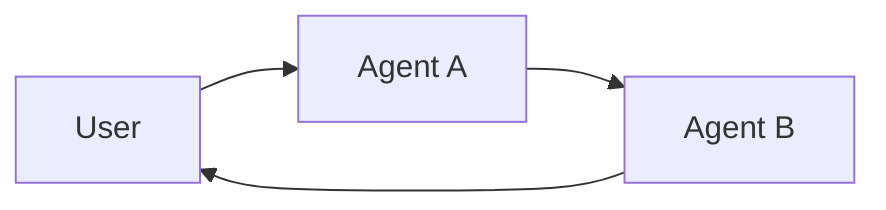

**Multi-agent 시스템**은 복잡한 애플리케이션을 여러 전문화된 agent로 분할하여 함께 문제를 해결하도록 합니다.
모든 단계를 단일 agent가 처리하는 대신, **multi-agent 아키텍처**를 사용하면 더 작고 집중된 agent들을 조정된 워크플로우로 구성할 수 있습니다.

Multi-agent 시스템은 다음과 같은 경우에 유용합니다:

* 단일 agent가 너무 많은 tool을 가지고 있어 어떤 것을 사용할지 잘못된 결정을 내리는 경우
* Context나 memory가 너무 커져서 하나의 agent가 효과적으로 추적할 수 없는 경우
* 작업에 **전문화**가 필요한 경우 (예: planner, researcher, math expert)

## Multi-agent 패턴

| 패턴                           | 작동 방식                                                                                                                                                     | Control flow                                               | 사용 사례 예시                                 |
|-----------------------------------|------------------------------------------------------------------------------------------------------------------------------------------------------------------|------------------------------------------------------------|--------------------------------------------------|
| [**Tool Calling**](#tool-calling) | **supervisor** agent가 다른 agent를 *tool*로 호출합니다. "tool" agent는 사용자와 직접 대화하지 않고 작업을 실행하고 결과를 반환합니다.                  | 중앙 집중식: 모든 라우팅이 호출하는 agent를 통과합니다. | Task 오케스트레이션, 구조화된 워크플로우.        |
| [**Handoffs**](#handoffs)         | 현재 agent가 다른 agent로 **제어를 이전**하기로 결정합니다. 활성 agent가 변경되고, 사용자는 새 agent와 직접 상호작용을 계속할 수 있습니다. | 분산형: agent가 누가 활성 상태인지 변경할 수 있습니다.            | 다중 도메인 대화, 전문가 인계. |

<Card
    title="튜토리얼: Supervisor agent 만들기"
    icon="sitemap"
    href="/oss/python/langchain/supervisor"
    arrow cta="자세히 알아보기"
>
    중앙 supervisor agent가 전문화된 worker agent를 조정하는 supervisor 패턴을 사용하여 개인 비서를 만드는 방법을 배웁니다.
    이 튜토리얼에서는 다음을 다룹니다:
    * 다양한 도메인(캘린더 및 이메일)을 위한 전문화된 sub-agent 생성
    * 중앙 집중식 오케스트레이션을 위해 sub-agent를 tool로 래핑
    * 민감한 작업에 대한 human-in-the-loop 검토 추가
</Card>


## 패턴 선택하기

| 질문                                              | Tool Calling | Handoffs |
|-------------------------------------------------------|--------------|----------|
| 워크플로우에 대한 중앙 집중식 제어가 필요한가요?               | ✅ Yes        | ❌ No     |
| Agent가 사용자와 직접 상호작용하기를 원하나요?       | ❌ No         | ✅ Yes    |
| 전문가 간의 복잡하고 인간적인 대화가 필요한가요? | ❌ Limited    | ✅ Strong |

<Tip>
    두 패턴을 혼합할 수 있습니다 — agent 전환에는 **handoffs**를 사용하고, 각 agent가 전문화된 작업을 위해 **subagent를 tool로 호출**하도록 할 수 있습니다.
</Tip>

## Agent context 커스터마이징

Multi-agent 설계의 핵심은 **context engineering**입니다 - 각 agent가 어떤 정보를 볼지 결정하는 것입니다. LangChain은 다음에 대한 세밀한 제어를 제공합니다:

* 대화 또는 state의 어떤 부분이 각 agent에 전달되는지
* Subagent에 맞춤화된 전문화된 prompt
* 중간 추론의 포함/제외
* Agent별 입력/출력 형식 커스터마이징

시스템의 품질은 context engineering에 **크게 의존**합니다. 목표는 각 agent가 tool로 작동하든 활성 agent로 작동하든 작업을 수행하는 데 필요한 올바른 데이터에 액세스할 수 있도록 하는 것입니다.

## Tool calling

**Tool calling**에서는 하나의 agent("**controller**")가 다른 agent를 필요할 때 호출할 *tool*로 취급합니다. Controller는 오케스트레이션을 관리하고, tool agent는 특정 작업을 수행하고 결과를 반환합니다.

흐름:

1. **Controller**가 입력을 받고 어떤 tool(subagent)을 호출할지 결정합니다.
2. **Tool agent**가 controller의 지시에 따라 작업을 실행합니다.
3. **Tool agent**가 controller에게 결과를 반환합니다.
4. **Controller**가 다음 단계를 결정하거나 완료합니다.


```mermaid
graph LR
    A[User] --> B[Controller Agent]
    B --> C[Tool Agent 1]
    B --> D[Tool Agent 2]
    C --> B
    D --> B
    B --> E[User Response]
````

<Tip>
    Tool로 사용되는 agent는 일반적으로 사용자와 대화를 계속할 것으로 **예상되지 않습니다**.
    그들의 역할은 작업을 수행하고 controller agent에게 결과를 반환하는 것입니다.
    Subagent가 사용자와 대화할 수 있어야 하는 경우 **handoffs**를 대신 사용하세요.
</Tip>

### 구현

다음은 main agent가 tool 정의를 통해 단일 subagent에 액세스할 수 있는 최소한의 예시입니다:

```python
from langchain.tools import tool
from langchain.agents import create_agent


subagent1 = create_agent(model="...", tools=[...])

@tool(
    "subagent1_name",
    description="subagent1_description"
)
def call_subagent1(query: str):
    result = subagent1.invoke({
        "messages": [{"role": "user", "content": query}]
    })
    return result["messages"][-1].content

agent = create_agent(model="...", tools=[call_subagent1])
```


이 패턴에서:
1. Main agent는 작업이 subagent의 설명과 일치한다고 판단할 때 `call_subagent1`을 호출합니다.
2. Subagent가 독립적으로 실행되고 결과를 반환합니다.
3. Main agent가 결과를 받고 오케스트레이션을 계속합니다.

### 커스터마이징 지점

Main agent와 subagent 간에 context가 전달되는 방식을 제어할 수 있는 여러 지점이 있습니다:

1. **Subagent 이름** (`"subagent1_name"`): Main agent가 subagent를 참조하는 방식입니다. Prompting에 영향을 미치므로 신중하게 선택하세요.
2. **Subagent 설명** (`"subagent1_description"`): Main agent가 subagent에 대해 "알고 있는" 내용입니다. Main agent가 언제 호출할지 결정하는 방식을 직접적으로 형성합니다.
3. **Subagent에 대한 입력**: Subagent가 작업을 해석하는 방식을 더 잘 형성하기 위해 이 입력을 커스터마이징할 수 있습니다. 위 예시에서는 agent가 생성한 `query`를 직접 전달합니다.
4. **Subagent로부터의 출력**: Main agent에게 다시 전달되는 **응답**입니다. Main agent가 결과를 해석하는 방식을 제어하기 위해 반환되는 내용을 조정할 수 있습니다. 위 예시에서는 최종 메시지 텍스트를 반환하지만, 추가 state나 metadata를 반환할 수도 있습니다.

### Subagent에 대한 입력 제어

Main agent가 subagent에 전달하는 입력을 제어하는 두 가지 주요 레버가 있습니다:

* **Prompt 수정** – Main agent의 prompt 또는 tool metadata(즉, sub-agent의 이름과 설명)를 조정하여 언제 어떻게 subagent를 호출할지 더 잘 안내합니다.
* **Context 주입** – 정적 prompt에서 캡처하기 어려운 입력(예: 전체 메시지 기록, 이전 결과, 작업 metadata)을 agent의 state에서 가져오도록 tool 호출을 조정하여 추가합니다.

```python
from langchain.agents import AgentState
from langchain.tools import tool, ToolRuntime

class CustomState(AgentState):
    example_state_key: str

@tool(
    "subagent1_name",
    description="subagent1_description"
)
def call_subagent1(query: str, runtime: ToolRuntime[None, CustomState]):
    # Apply any logic needed to transform the messages into a suitable input
    subagent_input = some_logic(query, runtime.state["messages"])
    result = subagent1.invoke({
        "messages": subagent_input,
        # You could also pass other state keys here as needed.
        # Make sure to define these in both the main and subagent's
        # state schemas.
        "example_state_key": runtime.state["example_state_key"]
    })
    return result["messages"][-1].content
```


### Subagent로부터의 출력 제어

Main agent가 subagent로부터 받는 내용을 형성하는 두 가지 일반적인 전략:

* **Prompt 수정** – Subagent의 prompt를 개선하여 정확히 무엇을 반환해야 하는지 지정합니다.
  * 출력이 불완전하거나, 너무 장황하거나, 주요 세부 정보가 누락된 경우 유용합니다.
  * 일반적인 실패 모드는 subagent가 tool 호출이나 추론을 수행하지만 최종 메시지에 **결과를 포함하지 않는** 것입니다. Controller(및 사용자)는 최종 출력만 보므로 모든 관련 정보가 거기에 포함되어야 함을 상기시키세요.
* **커스텀 출력 형식** – Main agent에게 다시 전달하기 전에 코드에서 subagent의 응답을 조정하거나 보강합니다.
  * 예시: 최종 텍스트 외에 특정 state key를 main agent에게 다시 전달합니다.
  * 이를 위해서는 결과를 [`Command`](https://reference.langchain.com/python/langgraph/types/#langgraph.types.Command) (또는 동등한 구조)로 래핑하여 커스텀 state를 subagent의 응답과 병합할 수 있어야 합니다.

```python
from typing import Annotated
from langchain.agents import AgentState
from langchain.tools import InjectedToolCallId
from langgraph.types import Command


@tool(
    "subagent1_name",
    description="subagent1_description"
)
# We need to pass the `tool_call_id` to the sub agent so it can use it to respond with the tool call result
def call_subagent1(
    query: str,
    tool_call_id: Annotated[str, InjectedToolCallId],
# You need to return a `Command` object to include more than just a final tool call
) -> Command:
    result = subagent1.invoke({
        "messages": [{"role": "user", "content": query}]
    })
    return Command(update={
        # This is the example state key we are passing back
        "example_state_key": result["example_state_key"],
        "messages": [
            ToolMessage(
                content=result["messages"][-1].content,
                # We need to include the tool call id so it matches up with the right tool call
                tool_call_id=tool_call_id
            )
        ]
    })
```


## Handoffs

**Handoffs**에서는 agent가 서로 직접 제어를 전달할 수 있습니다. "활성" agent가 변경되고, 사용자는 현재 제어권을 가진 agent와 상호작용합니다.

흐름:

1. **현재 agent**가 다른 agent의 도움이 필요하다고 결정합니다.
2. 제어(및 state)를 **다음 agent**에게 전달합니다.
3. **새 agent**가 다시 인계하거나 완료하기로 결정할 때까지 사용자와 직접 상호작용합니다.




### 구현 (곧 제공 예정)

---

<Callout icon="pen-to-square" iconType="regular">
    [Edit the source of this page on GitHub.](https://github.com/langchain-ai/docs/edit/main/src/oss/langchain/multi-agent.mdx)
</Callout>
<Tip icon="terminal" iconType="regular">
    [Connect these docs programmatically](/use-these-docs) to Claude, VSCode, and more via MCP for    real-time answers.
</Tip>
