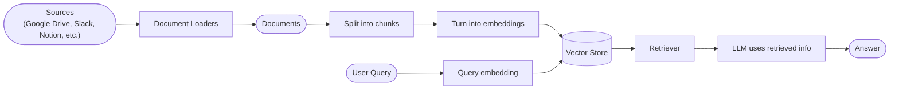
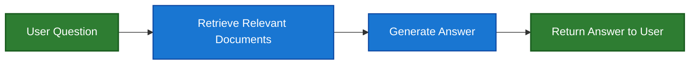
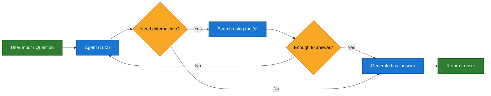
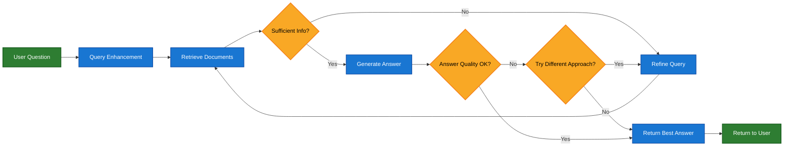

Large language model(LLM)은 강력하지만 두 가지 주요 제약이 있습니다:

* **제한된 context** — 전체 말뭉치를 한 번에 처리할 수 없습니다.
* **정적 지식** — 학습 데이터가 특정 시점에 고정되어 있습니다.

Retrieval은 쿼리 시점에 관련된 외부 지식을 가져와 이러한 문제를 해결합니다. 이것이 **Retrieval-Augmented Generation (RAG)**의 기초입니다: context에 특화된 정보로 LLM의 답변을 향상시키는 것입니다.


## Knowledge base 구축하기

**Knowledge base**는 retrieval 중에 사용되는 문서 또는 구조화된 데이터의 저장소입니다.

커스텀 knowledge base가 필요한 경우, LangChain의 document loader와 vector store를 사용하여 자체 데이터로부터 구축할 수 있습니다.

<Note>
    이미 knowledge base(예: SQL 데이터베이스, CRM 또는 내부 문서 시스템)가 있는 경우, 다시 구축할 필요가 **없습니다**. 다음과 같이 할 수 있습니다:
    - Agentic RAG에서 agent의 **tool**로 연결합니다.
    - 쿼리하고 검색된 콘텐츠를 LLM에 context로 제공합니다 [(2-Step RAG)](#2-step-rag).
</Note>

검색 가능한 knowledge base와 최소한의 RAG workflow를 구축하려면 다음 튜토리얼을 참조하세요:

<Card
    title="Tutorial: Semantic search"
    icon="database"
    href="/oss/python/langchain/knowledge-base"
    arrow cta="자세히 알아보기"
>
    LangChain의 document loader, embedding, vector store를 사용하여 자체 데이터로부터 검색 가능한 knowledge base를 만드는 방법을 배웁니다.
    이 튜토리얼에서는 PDF에 대한 검색 엔진을 구축하여 쿼리와 관련된 구절을 검색할 수 있도록 합니다. 또한 이 엔진 위에 최소한의 RAG workflow를 구현하여 외부 지식이 LLM 추론에 어떻게 통합될 수 있는지 확인합니다.
</Card>

### Retrieval에서 RAG로

Retrieval은 LLM이 런타임에 관련 context에 접근할 수 있게 합니다. 하지만 대부분의 실제 애플리케이션은 한 단계 더 나아갑니다: **retrieval과 generation을 통합**하여 근거가 있고 context를 인식하는 답변을 생성합니다.

이것이 **Retrieval-Augmented Generation (RAG)**의 핵심 아이디어입니다. Retrieval pipeline은 검색과 생성을 결합하는 더 광범위한 시스템의 기초가 됩니다.

### Retrieval Pipeline

일반적인 retrieval workflow는 다음과 같습니다:



각 구성 요소는 모듈식입니다: 앱의 로직을 다시 작성하지 않고도 loader, splitter, embedding 또는 vector store를 교체할 수 있습니다.

### Building Block

<Columns cols={2}>
    <Card
        title="Document loaders"
        icon="file-import"
        href="/oss/python/integrations/document_loaders"
        arrow cta="자세히 알아보기"
    >
        외부 소스(Google Drive, Slack, Notion 등)에서 데이터를 수집하여 표준화된 [`Document`](https://reference.langchain.com/python/langchain_core/documents/#langchain_core.documents.base.Document) 객체를 반환합니다.
    </Card>

    <Card
        title="Text splitters"
        icon="scissors"
        href="/oss/python/integrations/splitters"
        arrow
        cta="자세히 알아보기"
    >
        큰 문서를 개별적으로 검색 가능하고 모델의 context window에 맞는 작은 청크로 분할합니다.
    </Card>

    <Card
        title="Embedding models"
        icon="diagram-project"
        href="/oss/python/integrations/text_embedding"
        arrow
        cta="자세히 알아보기"
    >
        Embedding model은 텍스트를 숫자 벡터로 변환하여 유사한 의미를 가진 텍스트가 벡터 공간에서 가까이 위치하도록 합니다.
    </Card>

    <Card
        title="Vector stores"
        icon="database"
        href="/oss/python/integrations/vectorstores/"
        arrow
        cta="자세히 알아보기"
    >
        Embedding을 저장하고 검색하기 위한 특수 데이터베이스입니다.
    </Card>

    <Card
        title="Retrievers"
        icon="binoculars"
        href="/oss/python/integrations/retrievers/"
        arrow
        cta="자세히 알아보기"
    >
        Retriever는 비구조화된 쿼리가 주어졌을 때 문서를 반환하는 인터페이스입니다.
    </Card>
</Columns>

## RAG Architecture

RAG는 시스템의 요구 사항에 따라 여러 방식으로 구현될 수 있습니다. 아래 섹션에서 각 유형을 설명합니다.

| Architecture            | Description                                                                | Control   | Flexibility | Latency        | Example Use Case                                   |
|-------------------------|----------------------------------------------------------------------------|-----------|-------------|----------------|----------------------------------------------------|
| **2-Step RAG**          | Retrieval이 항상 generation 전에 발생합니다. 간단하고 예측 가능합니다         | ✅ High    | ❌ Low       | ⚡ Fast         | FAQ, 문서 봇                           |
| **Agentic RAG**         | LLM 기반 agent가 추론 중 *언제* 그리고 *어떻게* 검색할지 결정합니다 | ❌ Low     | ✅ High      | ⏳ Variable     | 여러 도구에 접근할 수 있는 연구 보조  |
| **Hybrid**              | 검증 단계를 포함하여 두 접근 방식의 특성을 결합합니다          | ⚖️ Medium | ⚖️ Medium   | ⏳ Variable     | 품질 검증이 있는 도메인별 Q&A        |

<Info>
**Latency**: Latency는 일반적으로 **2-Step RAG**에서 더 **예측 가능**합니다. 최대 LLM 호출 횟수가 알려져 있고 제한되어 있기 때문입니다. 이 예측 가능성은 LLM 추론 시간이 지배적인 요소라고 가정합니다. 그러나 실제 latency는 API 응답 시간, 네트워크 지연 또는 데이터베이스 쿼리와 같은 retrieval 단계의 성능에도 영향을 받을 수 있으며, 이는 사용되는 도구와 인프라에 따라 달라질 수 있습니다.
</Info>

### 2-step RAG

**2-Step RAG**에서는 retrieval 단계가 항상 generation 단계 전에 실행됩니다. 이 architecture는 간단하고 예측 가능하여 관련 문서의 검색이 답변 생성의 명확한 전제 조건인 많은 애플리케이션에 적합합니다.



<Card
    title="Tutorial: Retrieval-Augmented Generation (RAG)"
    icon="robot"
    href="/oss/python/langchain/rag#rag-chains"
    arrow cta="자세히 알아보기"
>
    Retrieval-Augmented Generation을 사용하여 데이터에 근거한 질문에 답변할 수 있는 Q&A 챗봇을 구축하는 방법을 확인하세요.
    이 튜토리얼은 두 가지 접근 방식을 안내합니다:
    * 유연한 tool로 검색을 실행하는 **RAG agent** — 범용 사용에 적합합니다.
    * 쿼리당 하나의 LLM 호출만 필요한 **2-step RAG** chain — 간단한 작업에 빠르고 효율적입니다.
</Card>

### Agentic RAG

**Agentic Retrieval-Augmented Generation (RAG)**은 Retrieval-Augmented Generation의 강점과 agent 기반 추론을 결합합니다. 답변하기 전에 문서를 검색하는 대신, agent(LLM으로 구동)가 단계별로 추론하고 상호 작용 중 **언제** 그리고 **어떻게** 정보를 검색할지 결정합니다.

<Tip>
Agent가 RAG 동작을 활성화하는 데 필요한 것은 문서 loader, web API 또는 데이터베이스 쿼리와 같은 외부 지식을 가져올 수 있는 하나 이상의 **tool**에 대한 접근입니다.
</Tip>



```python
import requests
from langchain.tools import tool
from langchain.chat_models import init_chat_model
from langchain.agents import create_agent


@tool
def fetch_url(url: str) -> str:
    """Fetch text content from a URL"""
    response = requests.get(url, timeout=10.0)
    response.raise_for_status()
    return response.text

system_prompt = """\
Use fetch_url when you need to fetch information from a web-page; quote relevant snippets.
"""

agent = create_agent(
    model="claude-sonnet-4-0",
    tools=[fetch_url], # A tool for retrieval [!code highlight]
    system_prompt=system_prompt,
)
```


<Expandable title="확장 예제: LangGraph의 llms.txt를 위한 Agentic RAG">

이 예제는 사용자가 LangGraph 문서를 쿼리하는 것을 돕기 위한 **Agentic RAG 시스템**을 구현합니다. Agent는 사용 가능한 문서 URL을 나열하는 [llms.txt](https://llmstxt.org/)를 로드하는 것으로 시작하며, 사용자의 질문에 따라 관련 콘텐츠를 검색하고 처리하기 위해 `fetch_documentation` tool을 동적으로 사용할 수 있습니다.

```python
import requests
from langchain.agents import create_agent
from langchain.messages import HumanMessage
from langchain.tools import tool
from markdownify import markdownify


ALLOWED_DOMAINS = ["https://langchain-ai.github.io/"]
LLMS_TXT = 'https://langchain-ai.github.io/langgraph/llms.txt'


@tool
def fetch_documentation(url: str) -> str:  # [!code highlight]
    """Fetch and convert documentation from a URL"""
    if not any(url.startswith(domain) for domain in ALLOWED_DOMAINS):
        return (
            "Error: URL not allowed. "
            f"Must start with one of: {', '.join(ALLOWED_DOMAINS)}"
        )
    response = requests.get(url, timeout=10.0)
    response.raise_for_status()
    return markdownify(response.text)


# We will fetch the content of llms.txt, so this can
# be done ahead of time without requiring an LLM request.
llms_txt_content = requests.get(LLMS_TXT).text

# System prompt for the agent
system_prompt = f"""
You are an expert Python developer and technical assistant.
Your primary role is to help users with questions about LangGraph and related tools.

Instructions:

1. If a user asks a question you're unsure about — or one that likely involves API usage,
   behavior, or configuration — you MUST use the `fetch_documentation` tool to consult the relevant docs.
2. When citing documentation, summarize clearly and include relevant context from the content.
3. Do not use any URLs outside of the allowed domain.
4. If a documentation fetch fails, tell the user and proceed with your best expert understanding.

You can access official documentation from the following approved sources:

{llms_txt_content}

You MUST consult the documentation to get up to date documentation
before answering a user's question about LangGraph.

Your answers should be clear, concise, and technically accurate.
"""

tools = [fetch_documentation]

model = init_chat_model("claude-sonnet-4-0", max_tokens=32_000)

agent = create_agent(
    model=model,
    tools=tools,  # [!code highlight]
    system_prompt=system_prompt,  # [!code highlight]
    name="Agentic RAG",
)

response = agent.invoke({
    'messages': [
        HumanMessage(content=(
            "Write a short example of a langgraph agent using the "
            "prebuilt create react agent. the agent should be able "
            "to look up stock pricing information."
        ))
    ]
})

print(response['messages'][-1].content)
```


</Expandable>

<Card
    title="Tutorial: Retrieval-Augmented Generation (RAG)"
    icon="robot"
    href="/oss/python/langchain/rag"
    arrow cta="자세히 알아보기"
>
    Retrieval-Augmented Generation을 사용하여 데이터에 근거한 질문에 답변할 수 있는 Q&A 챗봇을 구축하는 방법을 확인하세요.
    이 튜토리얼은 두 가지 접근 방식을 안내합니다:
    * 유연한 tool로 검색을 실행하는 **RAG agent** — 범용 사용에 적합합니다.
    * 쿼리당 하나의 LLM 호출만 필요한 **2-step RAG** chain — 간단한 작업에 빠르고 효율적입니다.
</Card>

### Hybrid RAG

Hybrid RAG는 2-Step과 Agentic RAG의 특성을 모두 결합합니다. 쿼리 전처리, retrieval 검증, 생성 후 검사와 같은 중간 단계를 도입합니다. 이러한 시스템은 고정된 pipeline보다 더 많은 유연성을 제공하면서 실행에 대한 일부 제어를 유지합니다.

일반적인 구성 요소는 다음과 같습니다:

* **Query enhancement**: 입력 질문을 수정하여 retrieval 품질을 향상시킵니다. 이는 불명확한 쿼리를 다시 작성하거나, 여러 변형을 생성하거나, 추가 context로 쿼리를 확장하는 것을 포함할 수 있습니다.
* **Retrieval validation**: 검색된 문서가 관련성이 있고 충분한지 평가합니다. 그렇지 않은 경우 시스템은 쿼리를 개선하고 다시 검색할 수 있습니다.
* **Answer validation**: 생성된 답변의 정확성, 완전성 및 소스 콘텐츠와의 일치성을 확인합니다. 필요한 경우 시스템은 답변을 재생성하거나 수정할 수 있습니다.

Architecture는 종종 이러한 단계 간의 여러 반복을 지원합니다:



이 architecture는 다음에 적합합니다:

* 모호하거나 불충분하게 지정된 쿼리가 있는 애플리케이션
* 검증 또는 품질 관리 단계가 필요한 시스템
* 여러 소스 또는 반복적인 개선을 포함하는 workflow

<Card
    title="Tutorial: Agentic RAG with Self-Correction"
    icon="robot"
    href="/oss/python/langgraph/agentic-rag"
    arrow cta="자세히 알아보기"
>
    Agentic 추론과 retrieval 및 자기 수정을 결합한 **Hybrid RAG**의 예제입니다.
</Card>

---

<Callout icon="pen-to-square" iconType="regular">
    [Edit the source of this page on GitHub.](https://github.com/langchain-ai/docs/edit/main/src/oss/langchain/retrieval.mdx)
</Callout>
<Tip icon="terminal" iconType="regular">
    [Connect these docs programmatically](/use-these-docs) to Claude, VSCode, and more via MCP for    real-time answers.
</Tip>
