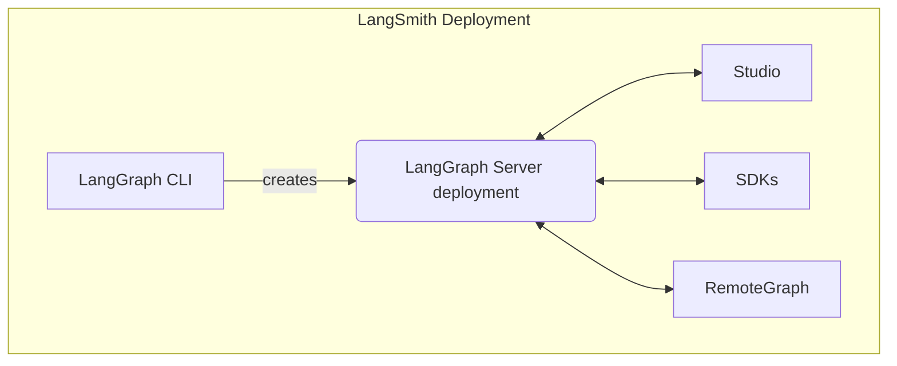

<Info>
**사전 요구사항**
* [LangSmith](/langsmith/home)
* [LangGraph Server](/langsmith/langgraph-server)
* [LangGraph CLI](/langsmith/cli)
</Info>

Studio는 LangGraph Server API 프로토콜을 구현하는 에이전트 시스템의 시각화, 상호작용 및 디버깅을 가능하게 하는 특화된 에이전트 IDE입니다. Studio는 [tracing](/langsmith/observability-concepts), [evaluation](/langsmith/evaluation), [prompt engineering](/langsmith/prompt-engineering)과도 통합됩니다.

## Features

Studio의 주요 기능:

* graph 아키텍처 시각화
* [에이전트 실행 및 상호작용](/langsmith/use-studio#run-application)
* [assistant 관리](/langsmith/use-studio#manage-assistants)
* [thread 관리](/langsmith/use-studio#manage-threads)
* [prompt 반복 작업](/langsmith/observability-studio)
* [dataset에 대한 실험 실행](/langsmith/observability-studio#run-experiments-over-a-dataset)
* [장기 메모리](/oss/concepts/memory) 관리
* [time travel](/oss/langgraph/use-time-travel)을 통한 에이전트 state 디버깅

Studio는 [LangSmith](/langsmith/deployment-quickstart)에 배포된 graph 또는 [LangGraph Server](/langsmith/local-server)를 통해 로컬에서 실행 중인 graph에서 작동합니다.

Studio는 두 가지 모드를 지원합니다:

### Graph mode

Graph mode는 전체 기능 세트를 제공하며, 순회한 node, 중간 state, LangSmith 통합(dataset 추가 및 playground 등)을 포함하여 에이전트 실행에 대한 가능한 한 많은 세부 정보를 원할 때 유용합니다.

### Chat mode

Chat mode는 채팅 전용 에이전트를 반복 작업하고 테스트하기 위한 더 간단한 UI입니다. 비즈니스 사용자와 전반적인 에이전트 동작을 테스트하려는 사용자에게 유용합니다. Chat mode는 state가 [`MessagesState`](/oss/langgraph/use-graph-api#messagesstate)를 포함하거나 확장하는 graph에서만 지원됩니다.

## Learn more

* Studio [시작하기](/langsmith/quick-start-studio) 가이드를 참조하세요.

## Video guide
<iframe
  className="w-full aspect-video rounded-xl"
  src="https://www.youtube.com/embed/Mi1gSlHwZLM?si=oWCeHQ640zPHoLwn"
  title="YouTube video player"
  frameBorder="0"
  allow="accelerometer; autoplay; clipboard-write; encrypted-media; gyroscope; picture-in-picture"
  allowFullScreen
></iframe>